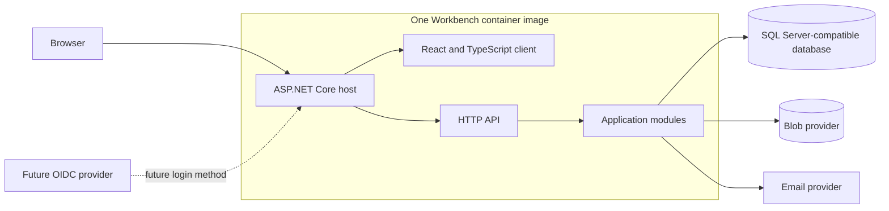
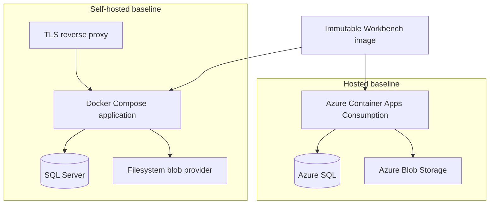

# Workbench architecture

**Status:** Accepted target architecture; application implementation has not begun.

This document is the authoritative living description of Workbench's current technical
architecture. Update it when the accepted architecture changes. The dated
[base-architecture specification](specs/2026-08-31-base-application-architecture.md) preserves the
decision context, alternatives, and acceptance criteria behind this direction. The
[application-foundation plan](superpowers/plans/2026-08-31-application-foundation.md) describes the
first implementation increment. Delivery is tracked by [GitHub issue #8](https://github.com/mcunille/Workbench/issues/8)
and its linked work items.

## Scope and implementation status

Workbench will begin as a portable, containerized modular monolith. A React and TypeScript client
and an ASP.NET Core API will be published together as one container image. SQL Server is the only
initial structured-data engine, and a provider-neutral blob contract isolates binary storage.

This is a target architecture, not a claim about deployed capability. The repository is currently
at the design stage. The linked implementation issues introduce the application shell, identity,
tenancy, storage, operations, and Azure deployment in independently verifiable increments.

Detailed inventory, purchasing, accounting, and commerce workflows are outside this document and
require focused specifications.

## Architectural invariants

1. Hosted and self-hosted installations use the same application source, feature set, data model,
   migrations, and container image.
2. The server is authoritative for authentication, authorization, tenant identity, and all durable
   state changes.
3. The server derives `TenantId` from durable authenticated user state. An ordinary client cannot
   select or override its tenant.
4. Every tenant-owned structured record has a non-null `TenantId`, and tenant-local uniqueness
   includes it.
5. A user belongs to exactly one tenant; a tenant may have multiple users.
6. SQL Server is the only initial structured-data engine. Documents that do not justify a separate
   database are stored as versioned JSON in SQL.
7. Binary content is stored behind a provider-neutral blob contract; metadata and tenant ownership
   remain in SQL.
8. The web tier is stateless across replicas. Durable sessions, jobs, and coordination live outside
   process memory.
9. Built-in ASP.NET Core Identity is the initial authentication system. External OIDC is an
   additive login method, not a replacement for Workbench tenant and authorization state.
10. Database migrations are an explicit deployment operation and do not run automatically when a
    web replica starts.
11. Secrets and provider credentials enter through deployment configuration and are never stored in
    source control, logs, the container image, or the browser.
12. New infrastructure is introduced only when measured requirements justify its operational cost.
13. Ordinary dual writes across independent stores are prohibited. Cross-store synchronization has
    one explicit source of truth, durable delivery, idempotency, observable retries, and reconciliation.

## Application structure

The browser uses one public origin. In production, ASP.NET Core serves the compiled client and the
API. During development, the client development server may proxy API requests, but that convenience
must not create a second production architecture.

The server is organized as a modular monolith. Each product module owns its application boundary,
domain rules, database objects, and migrations. Cross-module work uses explicit contracts rather
than reaching into another module's internals. The modules deploy and operate together until
measured scaling or isolation needs justify separating one.

## Data and storage

### Structured data

Azure SQL and self-hosted SQL Server use the same schema and versioned migrations. Relational tables
hold identities, tenancy, financial records, query-critical fields, integrity constraints, and blob
metadata. Flexible records such as draft details or lab-report payloads may use versioned JSON
columns when their invariants and reporting needs are still enforced by the surrounding relational
model.

JSON documents include an explicit schema version. Frequently filtered or joined values are promoted
to typed columns or indexed computed columns. A separate document database is considered only after
measured scale, query, availability, or isolation requirements show SQL Server is no longer a
reasonable fit.

### Tenant isolation

Tenant isolation is enforced in layers:

1. Authentication resolves the local user and their single tenant membership.
2. Request middleware establishes one immutable `TenantId` for the request.
3. Application commands and queries require tenant context.
4. Repository and ORM conventions apply tenant filters to tenant-owned data.
5. Relationships between tenant-owned records enforce tenant consistency with database constraints,
   and tenant-local uniqueness includes `TenantId`.
6. Blob object names and metadata are tenant-scoped.
7. Integration and adversarial tests attempt cross-tenant reads, writes, identifier substitution,
   attachment access, and background processing.

The system must not accept a caller-supplied tenant identifier as authority. Administrative and
background operations use separate, explicit privileged interfaces and remain auditable. Platform
administration is a separate authority and receives no implicit access to tenant data.

Before tenant domain data is implemented, a focused design must evaluate SQL Server row-level
security with connection pooling, migrations, background jobs, and administrative access. The
project must either adopt database row-level security or document and security-review an equivalent
database-enforced control.

### Blob storage

The application depends on a blob abstraction rather than Azure SDK or filesystem types. The initial
providers are Azure Blob Storage for hosted deployments and filesystem storage for self-hosted and
local deployments.

SQL stores each blob's stable identifier, `TenantId`, provider-neutral object identifier, media type,
size, checksum, lifecycle state, and audit timestamps. Provider object keys are generated by the
server and are not derived directly from user filenames. Downloads are authorized through application
metadata before bytes are returned or a short-lived provider URL is issued.

Uploads are streamed, bounded by configured limits, checked against an allowlist, and validated using
content inspection rather than trusting the supplied extension or media type. Writes use a staged
lifecycle so a blob and its SQL metadata cannot silently diverge. Provider contract tests cover both
Azure Blob Storage and filesystem implementations.

Failed uploads, abandoned temporary objects, and missing bytes are expected failure states. A
reconciliation operation reports and safely handles metadata/blob divergence without deleting
unrelated tenant content. If another store is introduced later, application code must not pretend it
shares an ACID transaction with SQL.

The filesystem provider resolves every generated object identifier beneath one dedicated absolute
storage root and verifies canonical containment before access. It rejects path separators, absolute
paths, traversal segments, symbolic links, and Windows reparse points. Its operating-system identity
has access only to that root, and neither the web host nor the reverse proxy serves the root directly.

Before accepting untrusted files, the relevant upload specification must define malware handling,
safe content disposition, and the scope of any direct-upload credentials in addition to media and
size validation.

## Identity and authorization

Initial authentication uses built-in ASP.NET Core Identity with durable server-side session state.
Cookies contain an opaque session reference rather than a complete authorization state. Session
records are authoritative for the user, security version, expiration, and revocation state. Every
protected request validates the session record and current account status. Credential changes,
tenant-authority changes, account disabling, and security-sensitive recovery advance durable security
state and revoke affected sessions in the same transaction. The design supports revoking one session
or all sessions for a user across restarts and replicas.

Cookie-protection keys use a shared durable key ring with deployment-supplied at-rest protection.
Azure uses managed secret or key facilities; self-hosting supplies equivalent key material through
mounted secrets or another documented secret store. Scaling and routine deployment preserve valid
sessions.

State-changing browser requests require antiforgery protection. Login, recovery, and other sensitive
flows use non-enumerating failure responses, shared multi-replica-safe rate limits, and audit records.
Rate limits include a normalized account dimension and a client-network dimension derived only
through trusted proxy configuration, so adding replicas cannot reset an attacker's attempt budget.
Password reset and email verification use verified, time-limited operations through a provider-neutral
email contract. Messages contain short-lived, single-purpose links and never disclose account
existence to an unauthenticated requester. Local development uses a non-delivering sink. Production
readiness requires a configured provider; the initial portable provider uses authenticated SMTP with
encrypted transport and certificate validation.

HTTPS is required outside explicit local-development profiles. Authentication cookies are same-origin
and set `Secure`, `HttpOnly`, and at least `SameSite=Lax`. Framework-maintained password hashing is
used, and browser storage never holds access or refresh tokens.

External OIDC may later link a verified external identity to an existing Workbench account. Workbench
remains authoritative for `TenantId`, account status, roles, permissions, session revocation, and audit
history. Account linking must defend against issuer/subject confusion and unintended account merging.

Authorization policies are explicit and deny by default. Tenant resolution happens before tenant data
access, and possession of a record or blob identifier never grants access by itself.

## Deployment profiles

| Profile | Application runtime | Structured data | Blob data | Public edge |
| --- | --- | --- | --- | --- |
| Local development | ASP.NET Core plus the client development server | Developer SQL Server instance | Filesystem provider | Localhost |
| Hosted baseline | Azure Container Apps Consumption, minimum zero replicas | Azure SQL | Azure Blob Storage | Managed HTTPS ingress |
| Self-hosted baseline | One application service in Docker Compose | SQL Server | Filesystem provider | TLS reverse proxy |

Hosted deployments use managed identity instead of stored Azure credentials wherever the selected
service supports it. Version-controlled Bicep describes Azure resources and configuration.

The self-hosted baseline targets one server but is configuration, not an application assumption.
Database, blob, email, session, and other durable providers are selected through configuration so the
same image can use external services or multiple replicas. Azure Container Apps may scale to zero;
the first request after idle may therefore have cold-start latency.

For self-hosting, the application origin listener is private to the deployment network by default.
Only explicitly configured proxy addresses may supply forwarded scheme, host, or client-address data.
Production configuration requires an allowlisted public host and one canonical public origin. Security
links and redirects use that configured origin and never request-supplied host or forwarded metadata.
Startup validation rejects inconsistent proxy, origin, provider, and replica settings.

## Runtime and operations

### Statelessness and health

Replicas do not depend on sticky sessions, local durable files, or in-memory job state. Liveness
reports whether the process can run. Readiness verifies the dependencies needed to serve traffic and
must not report ready while required schema changes are absent. Graceful shutdown stops accepting new
work and allows bounded in-flight work to finish. Container-local files are read-only application
artifacts or disposable temporary data, never authoritative state.

### Configuration and secrets

The application uses validated, typed configuration. Environment variables and mounted secret files
are supported consistently across deployment profiles. Startup fails clearly when required settings
are absent or incompatible. Production profiles fail closed when required security, database,
storage, proxy, or key settings are missing, and development defaults cannot silently activate in
production. Secrets never enter the React build, source control, logs, or container image.

### Background work

Initial background processing uses a durable SQL-backed queue with leases, retry policy, idempotency,
and dead-letter handling. Any replica may process work. Enqueueing and related business state changes
share a transaction or an outbox pattern so work is not silently lost. A dedicated worker process can
be introduced later without changing application job semantics.

### Observability and audit

Structured logs, metrics, and distributed traces use standard instrumentation and include correlation
identifiers, deployment version, and safe tenant context. Operational telemetry must not expose
credentials, session values, connection strings, reset tokens, attachment contents, or unnecessary
personal or commercial data. Retention, sampling, and ingestion caps are explicit deployment settings.

Application boundaries emit only allowlisted structured fields. Central redaction removes known
sensitive fields from framework, dependency, exception, and application output before export;
production does not rely on each call site remembering to redact independently.

Security-sensitive and financial actions produce append-oriented audit records that capture actor,
tenant, action, target, timestamp, correlation identifier, and safe outcome metadata. Ordinary users
and application flows cannot rewrite audit history.

### Backup and recovery

Every supported production profile documents backup and restore together. Hosted guidance covers
Azure SQL point-in-time recovery and configured blob recovery or versioning. Self-hosted tooling pairs
a SQL backup with a corresponding blob manifest or storage snapshot. Restore drills validate tenant
ownership, blob checksums, schema version, key availability, application startup, and representative
data access.

Backups are encrypted, stored outside the running application host, and identified by application and
schema version.

A restore invalidates every pre-restore browser session before the application becomes ready. The
procedure removes restored session records and rotates or advances authentication protection state so
a cookie issued against rolled-back account, role, or revocation data cannot become valid again.

Exact recovery objectives remain a service-level decision, but a feature is not operationally complete
until both its SQL and blob state can be recovered coherently.

### Release and migration

CI builds one non-root, minimal-runtime container image, generates an SBOM, scans dependencies and the
image, and records source revision, dependency inventory, and immutable image digest. Deployment
automation verifies that provenance before running the matching migration and releasing the image.

Migrations run separately using a principal with schema-change rights. Web replicas use a principal
without DDL or migration-history modification rights. Migration credentials are available only to the
controlled deployment operation and are never mounted into, stored by, or recoverable from the running
web workload. Migrations are forward-tested against Azure SQL and a supported self-hosted SQL Server
version. Destructive changes use an expand, migrate, and contract sequence with a verified backup and
an explicit compatibility window.

## Security and verification gates

Architecture-level verification includes:

- unit tests for domain and application rules;
- integration tests against real SQL Server for constraints, migrations, transactions, concurrency,
  tenant isolation, durable sessions, and the job queue;
- contract tests for every blob provider;
- browser tests for authentication, antiforgery, authorization, and representative workflows;
- deployment smoke tests for local, hosted, and self-hosted profiles;
- backup-and-restore drills; and
- dependency, secret, static-analysis, SBOM, image, and container-runtime checks.

Security review is required before implementing tenant domain data, external identity linking, file
handling, privileged administration, backup tooling, or a new persistence provider. Threat modeling
must cover tenant-boundary bypass, insecure direct object references, credential leakage, unsafe
attachments, migration privilege, supply-chain integrity, and administrative bypass.

## Evolution rules

The initial architecture deliberately preserves change seams without paying for every possible future
topology. Add a new database, extract a service, split the client deployment, or introduce a dedicated
worker only when measured requirements justify the operational burden. Such a change requires a
focused specification covering ownership, data migration, reconciliation, rollback, observability,
security, and hosted/self-hosted parity.

## Decision and delivery records

- [Accepted base-architecture specification](specs/2026-08-31-base-application-architecture.md)
- [Application-foundation implementation plan](superpowers/plans/2026-08-31-application-foundation.md)
- [Architecture implementation umbrella issue](https://github.com/mcunille/Workbench/issues/8)
- [Application foundation issue](https://github.com/mcunille/Workbench/issues/9)
- [Data and identity issue](https://github.com/mcunille/Workbench/issues/10)
- [Storage and operations issue](https://github.com/mcunille/Workbench/issues/11)
- [Azure deployment issue](https://github.com/mcunille/Workbench/issues/12)
