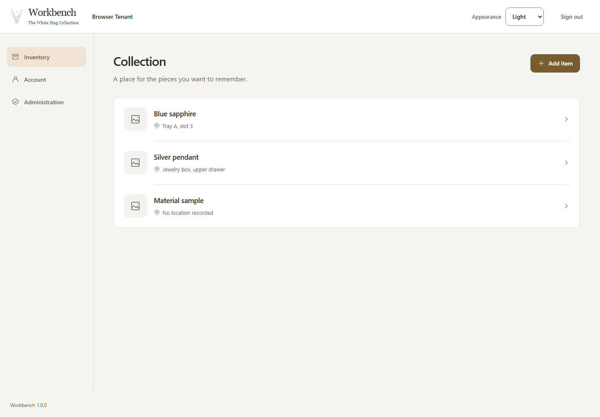

# H1 studio refinement

This refinement implements the owner's request for a more beautiful, polished and modern H1 UI
within the accepted [UI direction](../../specs/2026-09-06-ui-design-guidance.md). It changes
presentation, not inventory capability, authentication, API contracts, or data ownership.

## Approved gallery and material update

The owner subsequently approved responsive collection cards, a compact list option, and selective
translucency. This supersedes the original single-surface collection treatment and blanket exclusion
of glass below. The [accepted guidance](../../specs/2026-09-06-ui-design-guidance.md#visual-direction-a-calm-studio-workspace)
records that change. Earlier research and verification sections remain evidence for the first refinement.

[Gallery concept](gallery-concept.png) is a desktop/phone reference board generated for this update.
The implementation keeps the original stag, existing navigation labels, system sans headings and
native appearance control. The generated tenant dropdown is omitted because tenant switching is not
an H1 capability, and mobile navigation remains available. Cards show neutral image placeholders;
the design does not fabricate photographs or introduce photo upload.

The collection defaults to Grid. Grid and List are keyboard-operable pressed buttons in a named
group; switching changes presentation without replacing loaded records, changing links or fetching
again. View choice is local to the current collection visit. Each card uses a 3:2 placeholder above
name and location, a 16px radius, an opaque surface and a restrained shadow. A 24px gutter and 18rem
minimum column width produce three columns at 1440px and one on phones, while allowing long text to
wrap. List preserves the previous compact rows. Forms and record details stay opaque.

Only the header uses backdrop blur: 16px beneath 88% white in light mode or 92% charcoal in dark mode.
Unsupported blur, reduced transparency and forced colors use the solid surface token. Desktop
headers remain visible while scrolling; narrow or short viewports use normal document flow to keep
content accessible. Skip navigation stays above the header. Cards respond to precise-pointer hover
with a slight lift and shadow, and keyboard focus remains explicit. Reduced motion removes the lift.

| Fidelity check | Implementation decision |
| --- | --- |
| Composition | Responsive gallery replaces the earlier collection wrapper; compact list remains available. |
| Typography and copy | Existing sans title, exact task copy and navigation names retained; Grid and List are the only new visible labels. |
| Material and palette | Warm canvas, bronze and charcoal stay consistent; transparency belongs to header chrome, with opaque reading surfaces. |
| Card geometry | 3:2 image regions, 16px corners, 24px gutters and three desktop columns follow the normalized concept. |
| Brand and imagery | Original stag and outline icon family retained; generated brand substitutes and fictional photos are excluded. |
| Mobile | Single-column cards with complete controls; the concept's abbreviated phone chrome is not copied. |

The reference board is 1548x1016 including two device compositions, not a single viewport target.
Actual desktop and phone layouts are checked separately. The comparison is against the normalized
specification above, not literal pixel equivalence to generated typography or device frames.

[Desktop gallery](gallery-1440-light.png) · [Compact list](list-1440-light.png) · [Phone gallery, dark](gallery-390-dark.png)

The concept and these final Playwright captures were inspected together with `view_image` for all
six comparison points above. The first render used four small desktop columns; increasing the
minimum card width to 18rem corrected that mismatch. No material mismatch remains against the
normalized specification. In-app browser inspection at `http://127.0.0.1:4181` covered 1440x1000
and 390x844, Grid/List switching, opening details, and a real phone save surviving reload. The
temporary browser tab, viewport override, server and SQL database were cleaned up.

The focused presentation regression first failed because the Grid control was absent, then passed.
All 32 client tests and the first full 16-test browser run passed. Independent source review found
no actionable findings. The refreshed narrated recording passed its real SQL scenario and complete
audio/video decode, and its Grid/List frames were inspected. The current hardened-container gate
passed at `http://127.0.0.1:51595`. No new runtime dependencies were introduced; the built client is
226.27 kB JS (69.83 kB gzip) and 14.68 kB CSS (3.82 kB gzip). These are build sizes, not field metrics.
No automated mutation tool is configured for this client; the earlier bounded mutation evidence
below does not represent mutation coverage of the new gallery controls.

The final complete `scripts/verify.ps1 -SkipDependencyInstall` run passed with 305 server tests,
32 client tests, all 16 browser tests, formatting, contract drift, builds, all four migration
scenarios and published-release verification at `http://127.0.0.1:65258`. That browser run includes
the final three-column geometry, keyboard view changes without refetch, opaque cards, reduced
transparency, reduced motion and 200% text in the gallery. The disposable published instance was
cleaned up. Screen-reader and physical-device limitations described below still apply.

## Design and research

The earlier implementation used the control-border color for nearly every structural divider,
placed appearance in a separate full-width strip, and gave technical build metadata too much
visual emphasis. The refinement separates quiet structural edges from identifiable controls,
combines workspace controls in one header, and gives collection entries and saved records a
consistent identity treatment.

[Apple's typography guidance](https://developer.apple.com/design/human-interface-guidelines/typography?changes=_5)
supports a small, legible hierarchy of sizes and weights. Its
[materials guidance](https://developer.apple.com/design/human-interface-guidelines/materials?changes=l_8_1)
explains depth as a way to distinguish interface layers. Workbench applies that principle with
opaque surfaces; the accepted direction explicitly excludes glass blur. Disney's
[layout practice](https://www.disneyanimation.com/process/layout/) emphasizes staging and clear
composition, and its [animation practice](https://www.disneyanimation.com/process/animation/)
connects timing with readable action. Applying these film principles to task focus is a Workbench
design interpretation, not a Disney web-UI standard. Research was accessed on 2026-09-07.

### UI Skills follow-up research

The owner requested a further review of [UI Skills](https://www.ui-skills.com/). On 2026-09-07,
the catalog and four relevant skill texts were reviewed against the accepted guidance and current
H1 source at `5f2c4ff`. The earlier [research synthesis](../../specs/2026-09-06-ui-design-guidance.md#research-synthesis)
already covers layout, typography, accessibility and interface design. This follow-up adds the
following assessment; external skills were read as sources, not installed or adopted as workflow policy.

| Source | Useful lesson | Application to Workbench |
| --- | --- | --- |
| [improve-ui](https://www.ui-skills.com/skills/ibelick/improve-ui) | Ground findings in the governing design, the rendered ownership path and a demonstrable correction. | Keep future polish reviews tied to a specific task and evidence. A different stylistic preference alone does not establish a defect. Its audit-only workflow and exclusion of unsolicited accessibility findings do not replace repository verification requirements. |
| [better-ui](https://www.ui-skills.com/skills/jakubkrehel/better-ui) | Inspect optical alignment, distinguish structural borders from elevation, keep interactive motion interruptible, and avoid palette interpolation during theme changes. | The refinement already separates structural edges from controls, uses one currentColor icon family and changes theme colors immediately. Check concentric corners where surfaces actually share an inset; do not apply a radius equation to every control inside a spacious panel. |
| [12-principles-of-animation](https://www.ui-skills.com/skills/raphaelsalaja/12-principles-of-animation) | Keep timing consistent and attention focused on the action. | This is an independent author's adaptation of Disney principles, not official Disney web guidance. Retain brief press feedback and reduced-motion support; H1 does not need animated entrances or springs. |
| [frontend-ui-engineering](https://www.ui-skills.com/skills/addyosmani/frontend-ui-engineering) | Preserve the product's design system, simple state ownership, real content, and complete loading, empty and error states. | Continue with existing React and CSS owners. H1's shared appearance state and recoverable save states fit this direction. Examples of skeletons, optimistic updates and libraries are options to assess, not reasons to add them automatically. |

The sources are not one consistent specification. For example, better-ui recommends approximately
100ms stagger intervals for occasional staged entrances and ease-out exits; the animation skill
limits stagger intervals to 50ms and calls for ease-in exits. These are author preferences, not
universal correctness rules. Neither justifies changing H1's accepted 120ms feedback or introducing
staged motion. Likewise, exact press-scale recipes do not establish a defect in its subtle translation.

The useful next review priorities are optical alignment in real content, continuity through loading
and recovery, and assistive-technology checks. These are review priorities, not newly verified bugs.
This research adds no product changes or fresh browser-conformance claim. Current source confirms
explicit transition properties, reduced-motion handling and shared icon coloring; the rendered
evidence and its remaining limits are documented below. Documentation validation for this supplement
consists of source-link retrieval and `git diff --check`; application tests were not rerun for it.

## Visual specification

- Preserve the supplied gold stag, serif Workbench wordmark, bronze actions, local system body
  fonts, warm light canvas, and charcoal dark palette. Add no font, component, or animation dependency.
- Use a compact desktop header, a 14rem navigation rail, and a fluid content region capped at 76rem
  including its gutters. On phones, place appearance beside the brand and keep all navigation visible.
- Establish one 14px-radius collection surface, 56px neutral missing-photo placeholders, 17px item
  names, readable location lines, inset dividers, and consistent outline icons. Never imply uploaded
  photos or category classification where H1 has neither.
- Give the short form and saved record matching surfaces and spacing. Group descriptive fields
  ahead of record metadata; preserve complete identifiers and notes. Show a compact release label
  with the full build in its title metadata.
- Keep controls at least 44px, inputs 16px, clear blue focus outlines, and distinct disabled/error
  states. Change palette colors immediately; use 120ms press feedback only when reduced motion is off.

## References and fidelity review

[Collection concept](collection-concept.png) · [Form/detail/mobile concepts](states-concept.png)

[Implemented phone, dark](collection-390-dark.png)

[Loaded account at 320px](account-320-dark.png) · [Loaded administration at 320px](administration-320-dark.png)

The generated images are composition references constrained by the existing written design system.
They are not new domain specifications. The implementation was inspected in the Codex in-app browser
at `http://127.0.0.1:4179`, including a real save on desktop and phone. Reproducible Playwright captures
were compared directly with the concept images using `view_image`. The primary concept generated
at 1504x1046 rather than its requested 1440x1000; the app was inspected at 1440x1000 and multiple
responsive widths instead of treating raster scaling as a product requirement.

| Comparison | Result and deliberate refinement |
| --- | --- |
| Composition | One header, rail, title/action pair, and collection surface match the concept's hierarchy. Existing 14rem rail and 30px title interpretation avoid its oversized chrome. |
| Typography | Local system body/controls and serif brand retained. 24px phone headings and 16px inputs follow written guidance. The generated font is not shipped or substituted as a remote asset. |
| Palette | Accepted opaque semantic values retained. Generated saturated gold selection and metallic-looking fill are replaced by pale-bronze selection and flat accessible bronze actions. |
| Identity and icons | Original stag retained rather than the generated substitute. One small original SVG icon family replaces text diamonds/arrows; a shield identifies administration. |
| Form/detail structure | Single form surface, persistent labels, grouped actions, and a record identity header follow the state reference. Notes, identifier and added time retain the API's exact values. |
| Copy | Collection description, actions and field names remain unchanged. Redundant Inventory and Secure tenant access eyebrows are removed. The concept's invented phone subtitle and Added date label are not adopted. Workspace name comes from the authenticated tenant. |
| Responsive layout | The concept's phone navigation stack is replaced with the already accepted wrapping H1 links. Appearance keeps its accessible name while its visible label is omitted in the compact signed-in header. |
| Motion | A browser check caught transient low contrast during palette interpolation. Color transitions were removed; focus and press feedback remain without delaying input. |
| Shared panels | Final loaded phone specimens exposed a split Sessions heading beside its action. The narrow panel header now stacks, with a regression asserting the short heading fits on one line. |

The implementation follows the normalized design specification above; it deliberately does not
claim literal pixel equivalence to the generated concepts. Required controls, copy, spacing,
palette, icons, hierarchy, and responsive behavior were compared, with the differences recorded here.

## Verification

The header regression failed before appearance was moved into the banner, then passed with exactly
one appearance control and a compact release label. Independent review also caught a storage-denied
preference reset across authentication. A focused test reproduced the reset; preference state now
lives above the public/authenticated views, preserving the user's choice within the page. The
independent follow-up review found no remaining actionable issues. All 31 client tests, lint, and production build
passed. The added browser scenario passed at 390/768/1024/1440px in both appearances, with 200% text,
keyboard focus, reduced motion, and forced colors. Existing H1 tests continue to cover 320px and
1280px, long content, safe retry and navigation. Contrast assertions now include supporting text,
labels and navigation as well as item names.

One targeted manual mutation restored the full build hash to the release label; its regression
failed for the expected missing compact label. The original source was restored byte-for-byte.
This is bounded mutation evidence, not a comprehensive mutation-tool run or coverage score.

The production JS bundle is 225.81 kB (69.67 kB gzip); CSS is approximately 12.2 kB (3.3 kB gzip).
These are build-output measurements, not field Core Web Vitals. Automated and keyboard evidence does not
establish screen-reader conformance; NVDA, VoiceOver and physical mobile keyboard testing remain
outside this pass.

The complete `scripts/verify.ps1 -SkipDependencyInstall` gate passed: 305 server tests, 31 client
tests, 15 browser tests, formatting, generated-contract drift, builds, all four migration drills,
and the published-release probe at `http://127.0.0.1:56978`. The final hardened-container check
also passed at `http://127.0.0.1:56876`. These disposable instances were cleaned up. The application
state fix was included in the client build, browser checks, published probe, and final container.

The narrated demo was refreshed with the refined H1 screens and passed its real-database scenario.
Its MP4 decodes successfully and creation/mobile frames were visually inspected. After the final
narrow-panel correction, the affected browser and release checks were rerun separately; the H1
footage is unaffected by that account-panel adjustment.
All 15 browser tests passed again, the published probe passed at `http://127.0.0.1:64334`, and
the final hardened-container run passed at `http://127.0.0.1:51414`. Loaded account/admin screenshots
confirmed the heading correction and complete, readable content at 320px. No material visual
mismatches remain relative to the normalized specification and intentional deviations above.
