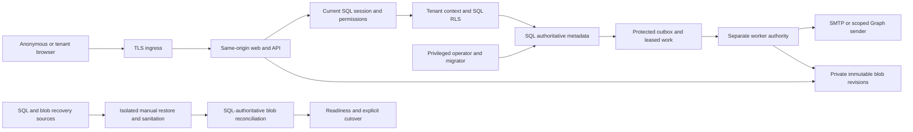

# Data, identity, and operations threat model

## Scope and evidence

This living model covers the implemented base architecture: the same-origin React/ASP.NET Core
release unit, SQL tenancy and identity, private blobs and photographs, durable background work,
email providers, self-hosted and Azure deployment, and manual recovery. It supersedes the earlier
phase-only model at this path. Source baseline: `f6c02c77d5a7f5af354d565f62ccc2d33c1f4fd7`
(merged login-admission fix, PR #89). References and development boundaries were reconciled
against `45a999b` on 2026-09-10; this does not redate the original security review.

This is an architecture and threat map, not a fresh vulnerability scan or a production attestation.
Scenarios below are review hypotheses, not unresolved findings. Dated operational results and
accepted verification limits belong in the [deployment verification record](../operations/deployment-verification.md).
The [architecture](../ARCHITECTURE.md), [security policy](../../SECURITY.md), and linked runbooks
remain authoritative for their respective contracts. Source references use stable repository-relative files and named symbols where needed.

## Components and authority

| Component | Responsibility and evidence |
| --- | --- |
| Browser and same-origin edge | UI is not an authorization boundary. Middleware processes proxy metadata, authenticates, authorizes, and checks antiforgery before protected operations. API misses remain API errors, separate from SPA fallback. `src/Workbench.Server/Program.cs` |
| Durable identity | Cookie validation resolves the session in SQL on every request and replaces its principal with current authority. Login admission precedes credential verification. `src/Workbench.Server/Identity/SessionAuthenticationEvents.cs`; `src/Workbench.Server/Identity/AuthEndpoints.cs` |
| Tenant persistence | Immutable request tenant context, EF filtering/save guards, tenant-consistent relational constraints, and nonce-bound SQL tenant proof with RLS form separate controls. A web connection alone is insufficient tenant authority. `src/Workbench.Server/Tenancy/TenantContextProof.cs`; `src/Workbench.Server/Persistence/WorkbenchDbContext.cs` |
| Blob and photo path | SQL owns attachment identity, state and content metadata. Filesystem/Azure providers publish immutable revisions; photographs pass bounded server decoding and re-encoding. Browser preparation does not replace validation. `src/Workbench.Server/Storage/FileSystemBlobStore.cs`; `src/Workbench.Server/Storage/AzureBlobStore.cs`; `src/Workbench.Server/Inventory/PhotoProcessor.cs` |
| Worker | Separate SQL authority leases durable work, applies tenant proof, validates current state, delivers identity messages or deletes eligible attachment content, and completes/retries with lease ownership checks. `src/Workbench.Server/Operations/WorkProcessor.cs` |
| Database control plane | Setup, operator, migrator and storage-maintenance operations require their own credentials/identities. Presence of the database CLI in an image does not itself grant those credentials. `src/Workbench.Database/Program.cs`; `src/Workbench.Server/Operations/WorkerHost.cs` |
| Recovery operator | Restores and sanitizes SQL, reconciles isolated blob content against SQL, explicitly accepts missing/corrupt files, and validates readiness before cutover. `src/Workbench.Server/Storage/FileRecovery.cs`; `src/Workbench.Server/Storage/FileRecoveryCommand.cs` |

## Protected assets and security objectives

Protected assets include tenant data and its existence; private media; passwords and hashes;
sessions and one-time identity capabilities; current permissions; tenant-proof and data-protection
keys; queue integrity; audit records; deployment identities and artifacts; and recoverable backups.

Required properties:

- Authenticate and authorize every protected request against current SQL state. Network location,
  proxy metadata, a cookie, a database credential, or a resource ID independently grants no tenant authority.
- Preserve tenant checks through HTTP, EF, relational constraints and SQL RLS, including connection
  pooling, background work, identifier substitution, exports and administrative endpoints.
- Validate antiforgery on state-changing browser requests, including anonymous identity operations.
- Apply shared SQL login limits to the submitted normalized account and network before credential
  verification, whether or not the account exists. Invalid or denied requests perform no password
  hashing/comparison. Admitted missing/passwordless accounts use a lazily cached process-wide dummy
  hash; this reduces unnecessary work but does not promise constant-time responses or DDoS immunity.
  `src/Workbench.Server/Identity/AuthEndpoints.cs`;
  `src/Workbench.Server/Identity/BuiltInPasswordVerifier.cs`;
  `src/Workbench.Server/Identity/DummyPasswordHash.cs`.
- Store session/identity-operation verification tokens as hashes. The delivery outbox is a distinct
  exception: it temporarily stores a data-protection-encrypted message containing the raw one-time
  token, bound to tenant and work ID. Decryption authority is sensitive. Never log raw tokens or
  include them in telemetry/audit metadata. `src/Workbench.Server/Identity/IdentityOperationService.cs`.
- Require explicit public recovery/invitation enablement, an available provider, and shared rate
  limiting. Recovery admission precedes account lookup; the public response does not disclose
  account existence. `src/Workbench.Server/Identity/IdentityOperationService.cs`;
  `src/Workbench.Server/Identity/RecoveryEndpoints.cs`.
- Keep workload and control-plane authority separate, and require SQL sanitation plus file recovery
  disposition before a restored service becomes ready. Backups alone do not establish safe recovery.

## Deployment trust boundaries

### HTTP ingress

`KnownProxies` mode accepts configured addresses and narrow networks with one to three forwarded
hops. The self-hosted origin must be reachable only through the intended proxy; TLS termination,
certificate renewal, listener exposure and host controls remain deployment responsibilities.
`src/Workbench.Server/Security/PublicEndpointConfiguration.cs`.

`AzureContainerApps` mode is an explicit, narrower-purpose trust decision: all workloads in the
managed environment are trusted **only for forwarded client IP and protocol metadata**. It uses
one hop and no address lists because platform peers change. It does not consume forwarded Host or
use this trust to establish identity, tenant, permissions or SQL access. Canonical HTTPS origin
and explicit allowed hosts are validated separately.
`src/Workbench.Server/Security/PublicEndpointConfiguration.cs`.

Deployment context accepted by the operator: the environment is a controlled deployment boundary.
An attacker who gains an internal workload can supply misleading forwarding metadata, including
through internal routes. Therefore network rate-limit partitions are not an independent defense
against that attacker; account partitions and application authorization remain necessary. The
application cannot prove this environment-membership assumption from headers. Restricting who may
deploy workloads is an operational obligation. This exception does not extend to any data boundary.

### SQL, blobs and platform identities

Azure foundation templates disable public SQL, blob and vault access and define private endpoints
and private DNS. These restrict network reachability; they do not replace Entra/RBAC, SQL roles or
tenant enforcement. `infra/azure/modules/foundation.bicep`.

Web and worker blob access is container-scoped, not tenant-scoped Azure RBAC. Likewise a filesystem
workload can access its configured root. Isolation within that authority depends on SQL ownership,
application checks and constrained object naming. Compromise of the whole web/worker process is
stronger than possession of only its SQL credential and can expose shared workload secrets and
blob authority. `infra/azure/modules/access.bicep`;
`src/Workbench.Server/Operations/OperationalConfiguration.cs`.

On Linux, filesystem publication uses `renameat2` without replacement and directory `fsync`;
Windows uses non-overwriting `File.Move` and has a different durability implementation. Volume
atomicity and crash guarantees must be verified on the actual host/filesystem, especially with
Docker bind mounts. `src/Workbench.Server/Storage/ConfinedDirectory.cs`.

### Effective resources and secret precedence

Configuration names below describe references, never secret values. File mounts and separate
settings do not themselves prove host ACL isolation.

| Consumer/path | Effective configuration and location | Authority and enforcement |
| --- | --- | --- |
| Web SQL | `ConnectionStrings:WorkbenchFile` takes precedence over `ConnectionStrings:Workbench`, then `WORKBENCH_WEB_CONNECTION`. Files must be nonempty. | Web SQL principal; production startup validation. `src/Workbench.Server/Security/DeploymentSecrets.cs`; `src/Workbench.Server/Security/ProductionSecurityConfigurationValidator.cs` |
| Worker SQL | `ConnectionStrings:WorkerFile`, then `ConnectionStrings:Worker`, then `WORKBENCH_WORKER_CONNECTION`. | Separate worker connection, not the web credential. `src/Workbench.Server/Operations/WorkerHost.cs` |
| Tenant proof | Nonblank `TenantContext:ProofKey` (or legacy direct environment fallback) wins over `TenantContext:ProofKeyFile` (or legacy file fallback). This differs from connection-file precedence. | Workloads receive proof secret separately from SQL credentials; SQL controls protect its database copy. `src/Workbench.Server/Security/ProductionSecurityConfigurationValidator.cs`; `src/Workbench.Server/Tenancy/TenantContextProof.cs` |
| Data protection | SQL key ring, application name `Workbench` in production; `DevelopmentEnvironmentIdentity.GetSuffix` appends a validated environment ID in isolated development. Configured certificate path precedes the legacy path. Password file precedes configured password then legacy fallback. Current certificate encrypts new keys; configured previous certificates decrypt old ones. | Web replicas share keys. Worker disables automatic key generation. PFX loads use ephemeral private-key storage. `src/Workbench.Server/Program.cs`; `src/Workbench.Server/Security/DeploymentSecrets.cs`; `src/Workbench.Server/Operations/WorkerHost.cs` |
| Filesystem blobs | Absolute `Storage:Root`; objects named `<tenant-N>-<revision-N>.a` (staged) or `.b` (published). Provider alias binds provider, normalized root and installation UUID. | Confined filesystem operations; production requires durable storage, and replicas require shared/atomic declarations plus actual volume support. `src/Workbench.Server/Storage/FileSystemBlobStore.cs`; `src/Workbench.Server/Operations/OperationalConfiguration.cs` |
| Azure blobs | HTTPS `Storage:ContainerUri`; object path `<installation-N>/<tenant-N>/<revision-N>.<suffix>`; provider alias binds container and installation. | System-assigned managed identity, container-level grant, conditional create-only publication. `src/Workbench.Server/Operations/OperationalConfiguration.cs`; `src/Workbench.Server/Storage/AzureBlobStore.cs` |
| Local development | `dev-up.ps1` creates isolated SQL/blob resources and protected ignored `.dev-environment/secrets` files; the API binds to loopback. The retained manual workflow may load web and migrator credentials from ignored `.env.dev`. | Developer host access remains privileged; the web receives only its web SQL credential. Preview ownership checks prevent adopting another checkout's resources. `scripts/dev-environment/Compose.ps1`; `scripts/dev-environment/Database.ps1`; `scripts/dev-environment/State.ps1`; `scripts/dev-env.ps1`; [setup](../setup.md) |
| SMTP | `Smtp` configuration with `PasswordFile` overriding password; canonical public origin supplies message-link origin. | SMTP configuration can also be present in the web workload for readiness; unlike Graph, it is not a worker-only credential boundary. Transport validation and host/recipient configuration remain required. `src/Workbench.Server/Operations/OperationalConfiguration.cs` |
| Graph | Validated `Graph` options and matching canonical origin; worker selects the mail managed identity. Web uses a queue-only provider. | Exchange mailbox-scoped send authorization is an external configuration obligation; avoid broader additive application grants. `src/Workbench.Server/Operations/WorkerHost.cs`; `src/Workbench.Server/Identity/GraphIdentityMessageDelivery.cs` |
| Azure secret delivery | Key Vault references mounted into workloads; access module grants specific secrets to workload principals. | Scope grants independently from blob and SQL authority; migration connection belongs to migration workload. `infra/azure/modules/access.bicep`; `infra/azure/modules/workloads.bicep` |
| Maintenance/setup/migration | Explicit connection/configuration files for CLI commands, or provisioned managed identities. | Privileged principals are not browser authority; temporary bootstrap access and local recovery artifacts require protection and cleanup. `src/Workbench.Database/Program.cs`; [bootstrap runbook](../operations/azure-bootstrap-host.md) |
| Backup/recovery | SQL restore point plus retained blob content, installation binding and protected recovery keys. Native Azure and custom/offline workflows have different consistency/retention contracts. | Recovery operator, not the serving workload, authorizes target selection and cutover. [Native backup](../operations/azure-native-backup.md); [manual recovery](../operations/online-backup-recovery.md) |

### Concrete deployment mounts and backup roles

Production Compose maps protected host files `${WORKBENCH_SECRET_DIRECTORY}/<secret>` into
`/run/secrets/`. App and worker share `tenant-proof`, `data-protection.pfx`, `certificate-password`
and `smtp-password`, but receive separate `web-connection` and `worker-connection` files. Both
mount the named blob volume at `/var/lib/workbench/blobs`, giving effective object paths
`/var/lib/workbench/blobs/<tenant-N>-<revision-N>.{a,b,c}`; `.c` is an in-progress copy.
`compose.yaml`;
`src/Workbench.Server/Storage/FileSystemBlobStore.cs`.
The localhost installer generates a distinct topology with loopback-only published proxy ports;
general production Compose publishes ports 80/443. Do not assume one path's exposure applies to
the other. `scripts/setup-local-self-host.ps1`; `compose.yaml`.

Azure web/worker mounts use `/secrets/tenant-proof`, `/secrets/protection-pfx`,
`/secrets/protection-password` and, for SMTP, `/secrets/smtp-password`. The migration workload
receives `/secrets/connection`. `infra/azure/modules/workloads.bicep`.

The optional custom backup implementation is distinct from the selected native Azure backup
service. Its capture job can read source versions and write/read archive objects; locked
immutability is required to prevent replacement. Its separate expiration job has archive
read/delete authority without source-data or archive write/policy authority. Capture objects use
`<installation-N>/<backup-N>/objects/<hash-of-source-name-and-version>` and catalogs record
integrity outcomes and gaps. Neither the role declarations nor this model establish that a
schedule or lock is active. `infra/azure/backup.bicep`;
`src/Workbench.Server/Storage/OnlineBackup.cs`.

## Workers and recovery

A queue row is not sufficient authority to send a message. The worker locks the lease and checks
current operation purpose, hash, expiry, recipient, security version and state against the
protected payload. Completion/retry uses owner and generation checks. External delivery is not
transactional with SQL: a send followed by failed commit can be retried, so exactly-once email
arrival is not promised. `src/Workbench.Server/Operations/WorkProcessor.cs`.

Online SQL and blob backups need not capture one atomic instant. Recovery is manual into isolated
targets: guard the restored database, sanitize old sessions/identity operations/key state, inspect
blob content against SQL and revalidate before applying the accepted disposition. Orphan means
absent from **all** SQL revision rows, including retained history, not merely absent from active
attachments. Missing/corrupt published content requires explicit acceptance and tenant-visible
recovery notices. Production must not be resumed simply because the database is online.
`src/Workbench.Server/Storage/FileRecovery.cs`;
`src/Workbench.Server/Storage/FileRecoveryCommand.cs`;
`src/Workbench.Server/Persistence/FileRecoverySchema.cs`.

Geo-redundancy, versioning and backup retention address different failures. Replication alone can
replicate deletion/corruption; recovery also depends on retained versions/backup points, keys,
authorized access and tested procedures. See the runbooks for selected native controls and dated
evidence. This model does not claim a newly tested nonempty or cross-region restoration.

## Attacker stories and control failures to review

Attackers may initially control anonymous bodies/headers, malicious media, a tenant account,
foreign resource IDs, a stolen session/link, or tenant-admin input. They do not initially possess
host, database-owner, deployment, signing, vault or another tenant's credentials. Those compromises
are separate, higher-authority starting conditions.

| Priority | Scenario / new authority | Controls and remaining obligation |
| --- | --- | --- |
| High | Tenant user substitutes IDs or uses pooling to read/write another tenant. | Current session, immutable tenant, EF/constraints/RLS and nonce-bound proof must all survive each endpoint and worker path. Review `TenantIsolationTests` and `TenantConnectionPoolingTests`. |
| High | Stolen token survives revocation, is consumed twice, or is resurrected by restore. | Every-request SQL validation, transactional consumption and guarded sanitation. Review `RecoveryTests`, `RecoveryDispositionTests`, and `FileRecoveryTests`; operator cutover remains privileged. |
| High | Queue tampering sends a capability to a different recipient or deletes another tenant's live blob. | Tenant/work-purpose encryption, current-state validation, eligible deletion state, owner/generation leases. Evidence: `src/Workbench.Server/Operations/WorkProcessor.cs`. |
| High | Blob ID/path manipulation, symlink traversal or publication race exposes or replaces private content. | SQL-owned IDs, confined filesystem operations and create-only immutable Azure publication; blob credentials themselves remain root/container-wide. Evidence: `src/Workbench.Server/Storage/FileSystemBlobStore.cs`; `src/Workbench.Server/Storage/AzureBlobStore.cs`. |
| High | Setup/migrator/deployment credential theft changes schema, RLS, images or grants. | Separate principals, secret references, digest-bound release procedures, short-lived bootstrap authority, platform audit. Legitimate owner DDL is not a vulnerability; unintended acquisition is. |
| High | Request input becomes executable SQL or an operator gains unauthorized recovery authority. | Parameterized SQL/EF and bounded administrative commands; setup-only development recovery must not become a public or ordinary operator capability. Evidence: `src/Workbench.Server/Identity/BuiltInPasswordVerifier.cs`; `src/Workbench.Database/Program.cs`. |
| Medium | Account enumeration or password-KDF exhaustion through anonymous requests. | Generic responses; shared account/network admission before verification; cached dummy hash. No constant-time or volumetric-capacity guarantee. Evidence: `tests/Workbench.Server.IntegrationTests/LoginHashingTests.cs`. |
| Medium | CSRF or unsafe client rendering changes account state or leaks private data. | Antiforgery metadata/middleware, explicit DTOs, browser security headers, no persistent browser token storage. Evidence: `src/Workbench.Server/Program.cs`; `src/Workbench.Server/Identity/RecoveryEndpoints.cs`. |
| Medium | Malicious photo or export workload exhausts memory/CPU or exposes unintended media. | Bounded server photo parsing/re-encoding, tenant authorization and export limits; native libraries remain dependency attack surfaces. Evidence: `src/Workbench.Server/Inventory/PhotoProcessor.cs`; [export contract](../collection-export.md). |
| Medium | Forged forwarding metadata bypasses a network limit or confuses scheme. | Bounded proxy mode or explicit ACA environment trust; canonical origin/hosts and independent account limits. Internal workload compromise is a prerequisite for abusing the accepted ACA boundary. |
| Medium | Logs, error messages, backups or downloaded packages disclose secrets/private data. | Bounded safe telemetry and private exports; privileged backup stores and local downloads still require access/retention controls. Evidence: `src/Workbench.Server/Operations/SafeTelemetryLoggerProvider.cs`; [backup runbook](../operations/database-backup-restore.md). |

Priorities express review order and plausible impact, not calibrated vulnerability verdicts.
Critical impact would require broad unauthenticated compromise; High includes practical cross-tenant
access or replay after revocation; Medium includes meaningful abuse or account-state compromise;
Low requires limited exposure without stronger authority. Reachability, actual prerequisites and
independent controls determine a finding's severity, following the security policy.

## Verification and limitations

The model was refreshed through source inspection and an independent architecture pass. Source
and test references describe controls; they do not imply those tests were executed by this
documentation update. Existing regression coverage includes `LoginHashingTests`, `RecoveryTests`,
`GraphDeliveryTests`, `GraphWorkRetryTests`, `BlobRecoveryTests`, `FileRecoveryTests`,
`TenantIsolationTests`, and `ItemPhotoSafetyTests` under `tests/Workbench.Server.IntegrationTests/`.

Operator-supplied context accepts scale-to-zero cold-start latency and audit-only bootstrap
reproducibility. Those are operational tradeoffs, not exemptions from authorization or restoration
checks. Provider permissions, certificate renewal, backup availability, monitoring delivery,
platform configuration drift and release provenance require their runbook checks. This update
neither changes Azure nor establishes that the source baseline is deployed.

External OIDC, future financial workflows, general-purpose malware scanning, provider internals
and host/hypervisor security are not implemented guarantees of this model. Revisit it when a new
entry point, credential recipient, tenant-owned resource, privileged workflow or trust exception
is introduced.
