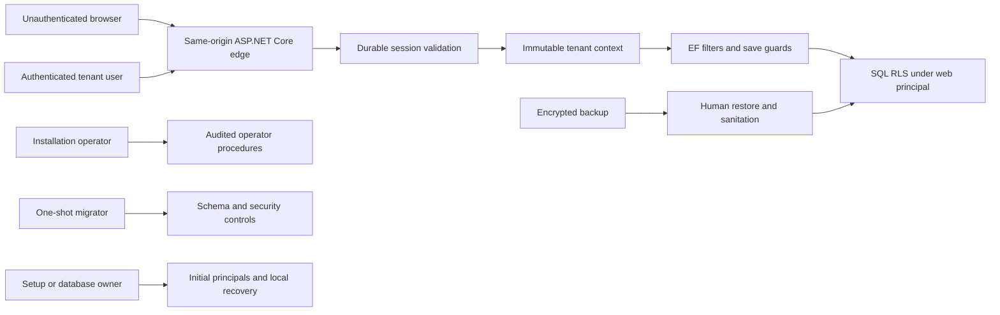

# Data and identity threat model

## Overview

This model covers Workbench's implemented SQL persistence, shared-database tenancy, built-in
password identity, durable browser sessions, tenant user administration, database control-plane
commands, and backup/restore boundary. It is a reusable model for the current architecture, not a
claim that each scenario is a vulnerability. The architecture pass was performed sequentially
because delegation was unavailable for this task.

| Component | Responsibility and source |
| --- | --- |
| Browser and React client | Same-origin UI; obtains an antiforgery request token in memory and relies on the server cookie (`src/Workbench.Client/src/api/auth.ts:15-40`) |
| ASP.NET Core edge | Bounded trusted-proxy processing, cookie authentication, authorization, and antiforgery middleware (`src/Workbench.Server/Program.cs:43-52`, `src/Workbench.Server/Program.cs:155-193`, `src/Workbench.Server/Program.cs:202-222`) |
| Durable identity | Password verification, hashed opaque sessions, hashed one-time operations, revocation, and authoritative request validation (`src/Workbench.Server/Identity/SessionAuthenticationEvents.cs:12-40`, `src/Workbench.Server/Identity/SessionService.cs:77-137`, `src/Workbench.Server/Identity/IdentityOperationService.cs:129-223`) |
| Tenant data path | Tenant claim becomes immutable request context, EF filters/save guards, read-only SQL session context, and RLS filter/block predicates (`src/Workbench.Server/Program.cs:109-130`, `src/Workbench.Server/Tenancy/TenantConnectionInterceptor.cs:12-37`, `src/Workbench.Server/Tenancy/TenantSaveChangesInterceptor.cs:37-46`, `src/Workbench.Server/Persistence/Migrations/20260902042420_AddTenantIsolation.cs:71-98`) |
| Database control plane | Separate setup, web, operator, and migrator roles; exact stored-procedure grants and explicit denials (`src/Workbench.Server/Persistence/Migrations/20260902053620_AddDatabasePrincipals.cs:12-27`, `src/Workbench.Server/Persistence/Migrations/20260902060523_AddDatabaseSecurityState.cs:144-150`) |
| Recovery operations | Human-run backup/restore, transactional security sanitation, and readiness generation check (`scripts/backup-database.ps1:1-33`, `scripts/restore-database.ps1:1-33`, `src/Workbench.Server/Persistence/Migrations/20260902060523_AddDatabaseSecurityState.cs:30-104`) |

### Effective resources

| Deployment or workflow | Resource or capability | Configuration and precedence | Safe effective value or location | Readers, writers, or recipients | Enforcing control | Evidence or unknowns |
| --- | --- | --- | --- | --- | --- | --- |
| Local application | Web database credential | `.env.dev` loaded into process by `dev-env.ps1` | Ignored worktree-local file; process receives only `WORKBENCH_WEB_CONNECTION` | Developer/agent running web process and SQL web user | Git ignore, loader allowlist, SQL grants/denials | `scripts/dev-env.ps1:5-52`; host file ACL remains an operator obligation |
| Production web | Web database credential | connection-string configuration or `WORKBENCH_WEB_CONNECTION` | Deployment secret delivered to web process | Web process and SQL web user | production startup validation and least-privilege SQL role | `src/Workbench.Server/Security/ProductionSecurityConfigurationValidator.cs:26-30`, `src/Workbench.Server/Security/ProductionSecurityConfigurationValidator.cs:53-55` |
| Production web | Cookie-protection key and certificate | SQL key ring plus configured certificate path/password | SQL `Identity.DataProtectionKeys`; mounted PFX; ephemeral private-key load | Web replicas and web SQL principal | data-protection APIs, certificate protection, container secret mounts | `src/Workbench.Server/Program.cs:133-151`; host certificate rotation/ACLs are deployment obligations |
| Migration | Schema-change authority | explicit connection file supplied to one-shot tool | Temporary protected file outside repository and image | Authorized release operator and migrator job | separate role; no credential in web workload | `src/Workbench.Database/Program.cs:26-31`, `scripts/migrate.ps1:7-21` |
| Operator | Tenant provisioning and restore sanitation | explicit operator connection file | Temporary protected file outside repository and image | Authorized installation operator | procedure-only grants; no tenant-table browsing | `src/Workbench.Server/Persistence/Migrations/20260902053620_AddDatabasePrincipals.cs:95-108`, `src/Workbench.Server/Persistence/Migrations/20260902060523_AddDatabaseSecurityState.cs:145-150` |
| Local recovery | Raw one-time recovery link | CLI requires explicit Development value, base URL, email, and a nonexistent output path | User-selected local file deleted after use | Setup/database owner and intended local user | operator is explicitly denied; token stored only as hash | `src/Workbench.Database/Program.cs:52-75`, `src/Workbench.Server/Persistence/Migrations/20260902060523_AddDatabaseSecurityState.cs:107-148` |
| Backup/restore | Full database contents and restore authority | explicit connection file, server-visible path, and exact confirmation | Encrypted backup store outside app host; isolated restore target | Database recovery operators only | SQL backup/restore permissions plus human cutover | `scripts/backup-database.ps1:1-33`, `scripts/restore-database.ps1:1-33`; storage encryption/retention are deployment obligations |

## Threat Model, Trust Boundaries, and Assumptions

Protected assets are tenant-owned data and existence, passwords and password hashes, session and
identity-operation capabilities, role/permission state, data-protection keys, audit integrity,
database schema/RLS controls, migration/operator credentials, backups, and the guarantee that a
restored pre-revocation cookie cannot regain authority.

Security objectives are:

- derive tenant authority only from a currently valid durable session and deny when it is absent;
- enforce the tenant boundary independently in HTTP authorization, EF, relational constraints, and
  SQL RLS, including pooled connections and identifier-substitution attempts;
- treat a cookie, record identifier, network address, application query, and database connection as
  individually insufficient authority;
- validate each protected request against current account, tenant, session, expiry, security
  version, and permission state;
- keep raw session/recovery/invitation values out of SQL, logs, client storage, and audit metadata;
- require antiforgery on state-changing cookie-authenticated and anonymous identity requests;
- keep public recovery/invitation unavailable until real delivery and shared multi-replica limiting
  exist (`src/Workbench.Server/Security/ProductionSecurityConfigurationValidator.cs:32-42`);
- keep setup, operator, migrator, and web credentials separate and absent from the browser and
  runtime image; and
- require sanitation and successful readiness checks after restore before traffic resumes.

Trust boundaries include unauthenticated browser to public HTTP, cookie-bearing browser to protected
HTTP, request principal to tenant context, EF to pooled SQL connection, web SQL role to RLS-protected
tables, tenant administrator to tenant-user endpoints, installation operator to signed procedures,
migrator to schema/security controls, deployment secret store to processes, and backup storage to the
restore operator.

Realistic attackers may control anonymous request bodies, headers outside the trusted-proxy
allowlist, a stolen cookie or one-time link, identifiers belonging to another tenant, their own
tenant user account, or malicious tenant-admin input. They do not initially control a database
owner, migrator, installation operator, deployment secret store, host filesystem, signed application
artifact, or another tenant's credentials. Compromise of those privileged systems is modeled as a
boundary failure because it adds broad authority; their already-authorized behavior is not itself a
vulnerability.

Assumptions and exclusions:

- TLS termination and forwarded headers are correct only when the configured single known proxy is
  the actual deployment proxy (`src/Workbench.Server/Program.cs:43-52`).
- Production protects the mounted certificate, certificate password, SQL secrets, and backups with
  host/platform access controls not implemented by this repository.
- Public email delivery and distributed rate limiting are intentionally unavailable in this phase;
  enabling public recovery before issue #11 supplies both is unsupported.
- Blob data, external OIDC, jobs, Azure infrastructure, malware handling, and financial domain
  authorization are outside this phase and require their own extensions to this model.
- A migrator can change RLS and grant itself data access by design. Protection is operational:
  short-lived delivery, independent authorization, audit, and no standing presence in web runtime.
- No independently delegated architecture review was permitted; material claims were checked in a
  sequential source pass and are covered by integration, browser, migration, and container tests.

## Attack Surface, Mitigations, and Attacker Stories

These are review hypotheses unless explicitly described as a verified control outcome.

| Priority | Scenario and capability gain | Prerequisites | Impact | Existing controls | Mitigation and evidence |
| --- | --- | --- | --- | --- | --- |
| 1 | Tenant bypass or IDOR lets a tenant user read/change another tenant's identity or future domain row | Authenticated lower-privilege user and a foreign identifier or malformed write | Cross-tenant confidentiality/integrity loss | Session-derived tenant, named policy, `404` substitution behavior, EF filters/save guard, composite keys, RLS | Preserve every layer and adversarial tests; `src/Workbench.Server/Administration/TenantUserEndpoints.cs:18-41`, `src/Workbench.Server/Persistence/WorkbenchDbContext.cs:64-166` |
| 1 | RLS bypass or pooled-connection leakage retains a previous request's tenant | Web SQL access plus missing/mutable session context or disabled policy | Broad cross-tenant database access | Context is set read-only on every connection open; missing value filters all tenant rows; web is denied policy alteration | Keep direct web-role tests and readiness policy checks; `src/Workbench.Server/Tenancy/TenantConnectionInterceptor.cs:12-37`, `src/Workbench.Server/Persistence/Migrations/20260902042420_AddTenantIsolation.cs:71-98`, `src/Workbench.Server/Persistence/Migrations/20260902060523_AddDatabaseSecurityState.cs:41-54` |
| 1 | Migration/setup secret theft changes schema, disables RLS, or mints credentials | Access to deployment secret, one-shot job, or local `.env.dev` | Installation-wide confidentiality/integrity compromise | Principal separation, secret-free web container, temporary files, explicit operations | Treat migrator/setup as control-plane credentials; shorten delivery, audit, rotate, and never expose to agents without a schema task; `scripts/bootstrap.ps1:7-47`, `scripts/migrate.ps1:7-21` |
| 1 | Unsafe restore resurrects revoked sessions, reset links, or old key material | Recovery operator restores an older database and resumes traffic without sanitation | Account takeover and rollback of authorization decisions | Transactional deletion/version advancement/key invalidation plus readiness generation check | Sanitation is mandatory before cutover; `src/Workbench.Server/Persistence/Migrations/20260902060523_AddDatabaseSecurityState.cs:71-104` |
| 2 | Stolen session cookie is replayed | Browser/transport/host compromise exposes protected cookie | User authority until revocation/expiry | `Secure`, `HttpOnly`, `SameSite=Lax`; 30-minute idle/12-hour absolute lifetime; hashed token; SQL validation every request; user revocation | Preserve authoritative validation and session UI; `src/Workbench.Server/Program.cs:155-173`, `src/Workbench.Server/Identity/SessionAuthenticationEvents.cs:12-40`, `src/Workbench.Server/Identity/SessionOptions.cs:7-25` |
| 2 | Recovery/invitation token race or database disclosure enables account takeover | Raw link theft, or simultaneous consumption; database-only theft should not reveal raw token | Password replacement and session invalidation | Only SHA-256 hash stored; serializable transaction with update locks; purpose/version/expiry/unused checks; exactly-once update | Retain concurrency tests and short lifetime; `src/Workbench.Server/Identity/IdentityOperationService.cs:129-223` |
| 2 | Login/recovery response or timing enumerates accounts | Anonymous requests at scale | User/tenant discovery and targeted credential attacks | Generic recovery `202`, generic invalid token, disabled production provider/limiter | Issue #11 must add normalized account plus trusted-network shared limiter and real delivery before public enablement; `src/Workbench.Server/Identity/RecoveryEndpoints.cs:38-55`, `src/Workbench.Server/Security/ProductionSecurityConfigurationValidator.cs:32-42` |
| 2 | CSRF signs in, changes passwords, consumes a recovery, or changes tenant users | Attacker can induce cross-origin requests from a victim browser | Account/tenant state changes under victim context | Strict same-origin antiforgery cookie and required header metadata on every state-changing route | Keep middleware before endpoint dispatch and browser/integration tests; `src/Workbench.Server/Program.cs:182-193`, `src/Workbench.Server/Program.cs:204-222`, `src/Workbench.Server/Identity/RecoveryEndpoints.cs:18-34` |
| 2 | SQL injection changes identity or tenant data | Attacker controls email, IDs, names, or audit metadata reaching SQL | Authentication bypass or database compromise | Parameterized SQL/EF for application inputs; operator identifiers use strict regex before bounded DDL | Continue rejecting dynamic SQL from request data and add tests for each new query builder; `src/Workbench.Server/Administration/OperatorCommands.cs:114-139`, `src/Workbench.Database/Program.cs:174-199` |
| 2 | Operator escalation uses recovery to take over an existing tenant | Compromised operator credential | Existing tenant administrator takeover | Operator lacks table browsing and is explicitly denied development recovery; provisioning and sanitation are procedure-only | Keep raw recovery at setup/database-owner boundary and rotate owner credential after setup; `src/Workbench.Server/Persistence/Migrations/20260902060523_AddDatabaseSecurityState.cs:144-150` |
| 3 | Client or telemetry exposes tokens, secrets, cross-tenant fields, or unsafe audit metadata | XSS, developer tooling, logging, or over-broad DTO | Credential replay or privacy loss | Cookie is HttpOnly; client stores only transient antiforgery token; DTOs are explicit; audit writer rejects sensitive metadata names | Preserve allowlists and do not add browser token storage; `src/Workbench.Client/src/api/auth.ts:15-40`, `src/Workbench.Server/Security/SecurityAuditWriter.cs:10-29` |
| 3 | Spoofed forwarded headers weaken secure-cookie or network limiter decisions | App is directly reachable or proxy allowlist is wrong | Scheme/client-address confusion | One exact known proxy and one forwarded hop; production container expects proxy termination | Keep origin listener private and startup configuration exact; `src/Workbench.Server/Program.cs:43-52` |

## Severity Calibration (Critical, High, Medium, Low)

| Severity | Workbench example | What lowers or negates it |
| --- | --- | --- |
| Critical | Unauthenticated remote code execution in the web process, or an unauthenticated path that disables RLS and exposes every tenant | Only a database owner/migrator can perform the action as an already-authorized control-plane operation |
| High | A tenant user can reliably read or modify another tenant; a stolen recovery token can be replayed after successful consumption; production restore makes revoked sessions valid again | RLS/tenant checks reject the access, token consumption is atomic, or sanitation blocks readiness |
| Medium | CSRF changes meaningful account state; account enumeration is practical at scale; a tenant administrator can exceed tenant-local authority | Antiforgery is required and validated, public recovery remains disabled, or effects remain within the attacker's already-authorized tenant administration |
| Low | Limited metadata exposure, overly long local session presence without privilege expansion, or a hardening gap requiring local filesystem access | No new authority, sensitive value, other-tenant data, or plausible supported deployment exposure is established |

Severity rises with unauthenticated reachability, cross-tenant scope, credential/control-plane gain,
repeatability, and absence of independent enforcement. It falls when exploitation requires an
already-authorized database owner/migrator, unsupported production configuration, host compromise,
or a control that direct tests show fails closed. Missing runtime evidence affects confidence; it
does not by itself increase impact.
