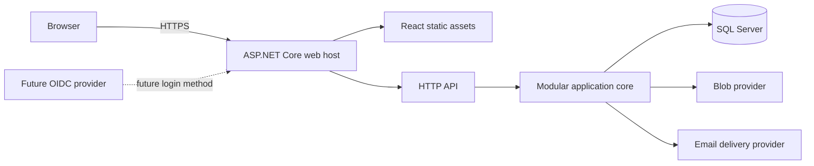
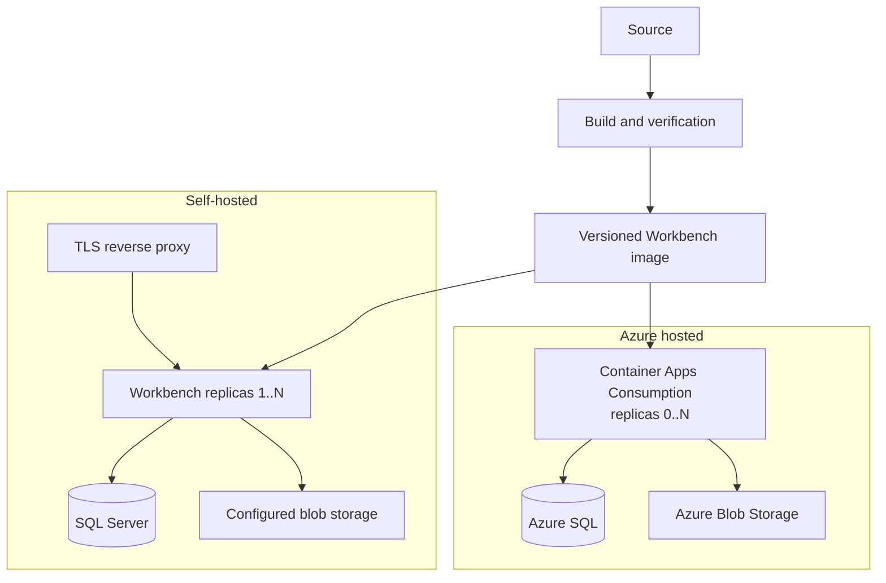

# Base application architecture

**Status:** Accepted

**Living architecture:** [`docs/ARCHITECTURE.md`](../ARCHITECTURE.md)

## Summary

Workbench will begin as a portable, containerized modular monolith with a React and TypeScript
client, an ASP.NET Core server, SQL Server for structured data, and provider-backed blob storage for
binary content. The same application image will run in Azure and in self-hosted environments. Azure
and self-hosted deployments may use different managed infrastructure, but they must not become
different application editions.

The initial hosted topology uses Azure Container Apps Consumption with scale-to-zero, Azure SQL,
and Azure Blob Storage. The initial self-hosted topology uses Docker Compose on one server, SQL
Server, and configured blob storage. One server is a packaging default, not an application
assumption: the web process remains stateless and supports multiple replicas when shared database,
key, and blob infrastructure are configured.

This specification defines foundational application and infrastructure boundaries. It deliberately
does not define inventory, purchasing, accounting, or commerce workflows.

## Context

Workbench must support three service models with one open-source product:

- local development;
- production self-hosting; and
- a managed hosted service, initially on Azure.

The hosted service is the primary expected use case, while development is primarily local. Hosted
convenience must not make Azure the only practical place to run the product or retrieve its data.
No reliable workload or growth measurements exist yet, so the architecture must avoid speculative
distributed infrastructure while preserving clear migration seams.

The architecture must also uphold two established product invariants:

- financial truth will eventually require strong relational integrity and transaction semantics;
- every tenant operation must occur within an identified tenant and explicit user authority.

## Goals

- Provide one portable application architecture for local, self-hosted, and Azure-hosted use.
- Minimize initial infrastructure cost and operational complexity.
- Keep the system easy to evolve when measured workloads justify new processes or storage engines.
- Establish enforceable tenant ownership and a portable built-in identity model.
- Keep deployment topology, persistence technology, and provider details out of public contracts.
- Make releases, migrations, telemetry, backup, and recovery part of the supported system.
- Allow the web tier to scale from zero or one replica to multiple replicas without application
  redesign.

## Non-goals

This specification does not define:

- domain workflows for inventory, purchasing, accounting, or commerce;
- a document database, distributed cache, external message broker, or search engine;
- microservices, Kubernetes, multi-region operation, or active-active failover;
- external OpenID Connect implementation;
- a complete tenant role and permission matrix;
- production service-level, recovery-point, or recovery-time commitments; or
- the pricing or capacity tier for a specific hosted environment.

These are separate, evidence-backed decisions. Their absence must not be disguised by placeholder
implementations in the base infrastructure.

## Architectural invariants

1. Workbench remains one open-source application across all deployment models.
2. A user belongs to exactly one tenant; a tenant may contain multiple users.
3. The server derives `TenantId` from durable authenticated user state. An ordinary client cannot
   select or override its tenant.
4. Every tenant-owned structured record carries a non-null `TenantId`.
5. Tenant-owned binary content is authorized through tenant-owned SQL metadata, never by possession
   of a storage key alone.
6. The web process holds no authoritative state in process memory or its container filesystem.
7. SQL Server is the initial source of truth for all structured data.
8. Cross-module writes may use one SQL transaction; ordinary dual writes across independent stores
   are prohibited.
9. Public API contracts do not expose database entities, ORM types, storage keys, or cloud-provider
   types.
10. Scaling the web tier changes deployment configuration, not domain or application code.

## System architecture

The client and server are separate code projects and logical boundaries. They initially ship as one
web deployable: ASP.NET Core serves the compiled React application and exposes the HTTP API under
`/api`.

Serving both surfaces from one origin avoids an initial cross-origin authentication and deployment
boundary. The React build remains independently testable and uses relative API URLs so it can move
to dedicated static hosting later without changing application behavior.

### Modular monolith

The server is one process initially, but it is not one undifferentiated module. Each application
module must have:

- a named responsibility;
- an explicit public contract for other modules;
- internal domain and persistence implementation;
- ownership of its tables and migrations; and
- dependency rules enforced by automated architecture checks.

Modules may share the physical database and participate in one transaction. They may not reach into
another module's internal services or tables as an informal integration mechanism. A module that
later needs a different process or storage engine can move behind its existing contract.

No universal generic repository will abstract every persistence operation. Modules use focused
persistence interfaces only where they create a meaningful boundary or testing seam.

## Deployment architecture

One versioned container image contains the published ASP.NET Core host and compiled React assets.
The image is the release unit for both hosted and self-hosted deployments.

### Hosted baseline

- Azure Container Apps Consumption runs the Workbench image with a minimum of zero replicas.
- Azure SQL supplies the SQL Server-compatible managed database.
- Azure Blob Storage stores binary content.
- Managed identity replaces stored Azure credentials where the selected service supports it.
- Version-controlled Bicep describes Azure resources and configuration.

Scale-to-zero cold starts are acceptable initially. If latency or sustained-load measurements later
favor App Service or another compute product, moving the standards-based ASP.NET Core image must not
require application changes.

### Self-hosted baseline

- Docker Compose describes the initial single-server deployment.
- A reverse proxy owns public TLS and forwards traffic to Workbench.
- The Workbench origin listener is private to the deployment network by default. Only explicitly
  configured proxy addresses are trusted to supply forwarded scheme, host, or client-address data.
- Production configuration requires an allowlisted public host and one canonical public origin.
  Security links and redirects use that configured origin, never request-supplied host metadata.
- SQL Server supplies the same database behavior and migrations as Azure SQL.
- The filesystem blob provider may be used when one host owns the configured storage path.
- Multiple replicas require a shared blob path or another shared provider implementation, plus the
  same shared SQL database and key material.

The application does not infer topology. Deployment configuration selects providers and replica
counts, and startup validation rejects internally inconsistent settings.

### Stateless web tier

- No session, job, tenant, or domain state is authoritative only in process memory.
- Local container files are read-only application artifacts or disposable temporary data.
- Cookie-protection key material and revocation state are durable and shared across replicas.
- Authentication abuse controls use shared, multi-replica-safe state. Limits include both a
  normalized account dimension and a client-network dimension derived only through the trusted
  proxy configuration; adding replicas cannot reset an attacker's attempt budget.
- Graceful shutdown stops new work and gives bounded in-flight requests time to finish.
- Liveness reports whether the process is alive; readiness reports whether it can safely receive
  traffic.
- Database migrations execute as a separate deployment operation before new replicas receive
  traffic. Replicas do not race to migrate at startup.

## Structured data

SQL Server is the only initial structured-data engine. Azure SQL and self-hosted SQL Server use the
same schema and versioned migrations.

Modules group their tables by SQL schema or an equivalently enforced naming boundary. Relational
columns represent identities, relationships, invariants, filtering, sorting, and reporting data.
JSON columns are permitted for variable or rarely queried extension data when all of the following
hold:

- the JSON shape is versioned;
- validation occurs before persistence;
- frequently filtered or reported properties are promoted to relational columns; and
- the JSON does not hide an entire aggregate merely to avoid relational modeling.

Application-generated identifiers must remain stable if data moves between tables, databases, or
providers. Persistence entities remain internal and do not automatically define domain models or
HTTP contracts.

### Tenant scoping

Tenant isolation uses multiple layers:

1. Authentication resolves the current user from durable server-side state.
2. The user establishes one immutable request `TenantId`.
3. Application data access applies tenant scoping by default.
4. Tenant-local uniqueness includes `TenantId`.
5. Relationships between tenant-owned records enforce tenant consistency with database constraints.
6. Privileged tenantless or cross-tenant work uses separate, explicit system interfaces and is
   audited.
7. Integration tests attempt cross-tenant reads, writes, relationships, and inference.

Global ORM query filters are a safe default, not a complete security boundary. The implementation
plan must evaluate SQL Server row-level security and its interaction with connection pooling,
migrations, background jobs, and administrative access. Before tenant domain data is implemented,
the project must either adopt database row-level security or document and security-review an
equivalent fail-closed database enforcement design.

## Blob storage

Blob providers store bytes; SQL stores authoritative metadata and ownership. Attachment metadata
includes at least its stable identifier, `TenantId`, provider-neutral object identifier, media type,
byte length, integrity hash, lifecycle state, and timestamps. Domain specifications add their own
relationship and retention rules.

Blob access follows this order:

1. Resolve attachment metadata under the current tenant scope.
2. Authorize the requested operation.
3. Ask the configured provider to read, create, or remove the bytes.
4. Record the resulting lifecycle transition durably.

Provider object identifiers are opaque internal values and are never bearer credentials. Provider
contract tests must run against Azure Blob Storage and filesystem implementations. Writes must use
unique temporary names and atomic publication semantics appropriate to the provider so interrupted
uploads do not appear complete.

The filesystem provider generates its own object identifiers and never treats a user-supplied name
or provider identifier as a filesystem path. Every operation resolves beneath one dedicated,
absolute storage root and verifies canonical containment before access. The provider refuses path
separators, absolute paths, traversal segments, symbolic links, and Windows reparse points in an
object path. Its operating-system identity receives access to that root only, and the root is not
served directly by the web host or reverse proxy.

Failed uploads, abandoned temporary objects, and missing bytes are expected failure cases. A
reconciliation operation reports and safely handles metadata/blob divergence without deleting
unrelated tenant content.

## Identity and authorization

The initial identity implementation uses ASP.NET Core Identity in SQL Server and supports built-in
credentials. Authentication uses secure, HTTP-only, same-origin cookies. Browser storage does not
hold access or refresh tokens.

The browser security baseline includes:

- HTTPS outside explicit local-development profiles;
- `Secure`, `HttpOnly`, and at least `SameSite=Lax` authentication-cookie attributes;
- anti-forgery protection for state-changing requests;
- framework-maintained password hashing;
- verified, time-limited email and password-reset operations;
- rate limits and non-enumerating failure responses on authentication endpoints; and
- audit records for sign-in and material account, role, or security changes.

The protected cookie carries a protected session identifier, while a durable SQL session record is
authoritative for the user, security version, expiration, and revocation state. Every protected
request validates that record and current account status. Disabling an account, resetting or changing
credentials, changing tenant authority, or performing another security-sensitive account recovery
increments durable security state and revokes affected sessions in the same transaction. This model
must work across restarts and replicas and support revoking one session or all sessions for a user.

Cookie-protection keys use a shared durable key ring and deployment-supplied at-rest protection.
Azure uses managed secret/key facilities; self-hosting supplies equivalent key material through
mounted secrets or another documented secret store. Scaling or redeployment must not invalidate all
active sessions.

Roles and permissions are tenant-local and enforced through named server-side authorization
policies. Platform administration is a separate authority and receives no implicit tenant-data
access.

Future OpenID Connect support links an external identity to a Workbench user. The provider proves
identity; Workbench remains authoritative for `TenantId`, account status, roles, and permissions.

Account verification and recovery use a focused email-delivery interface. Development may use a
non-delivering local sink; production requires a configured provider before readiness succeeds. The
initial portable provider uses authenticated SMTP, while later hosted-provider adapters may be added
without changing identity workflows. Email messages contain short-lived, single-purpose links and
must not disclose account existence to an unauthenticated requester.

Production SMTP requires encrypted transport with certificate validation. Verification and recovery
links are built from the canonical configured public origin, not `Host`, `Forwarded`, or
`X-Forwarded-*` values supplied by an untrusted request path.

## Configuration and secrets

Ordinary configuration uses environment variables or mounted configuration. Secrets use deployment
secret facilities or mounted secret files and never enter the React build, source control, logs, or
container image.

Configuration is strongly typed and validated before readiness succeeds. Production profiles fail
closed when required security, database, storage, proxy, or key settings are missing. Development
defaults are explicit and cannot silently activate in production.

## Durable background work

The base architecture does not require a message broker. When a workflow first needs asynchronous
work, it begins with SQL-backed durable job or outbox state and idempotent handlers. State changes
and their outbox records share one SQL transaction.

The scale-to-zero web process is not a scheduler. Work with a schedule or bounded completion latency
runs through an explicit worker or hosted job trigger reading the same durable state. Adding that
deployable does not move domain authority out of SQL.

If a future module adopts another data store, synchronization uses an explicit source of truth,
outbox delivery, idempotent consumers, observable retry state, and reconciliation. Code must never
pretend that SQL and another store share an ACID transaction.

## Observability and audit

Application instrumentation uses OpenTelemetry APIs for structured logs, metrics, and distributed
traces. Hosted deployments may export to Application Insights; self-hosted deployments may export
through OTLP or structured console output. Application code does not depend on one telemetry vendor.

Telemetry includes trace identifiers and safe tenant correlation where operationally necessary. It
excludes credentials, session values, connection strings, reset tokens, attachment contents, and
unnecessary personal or commercial data. Retention, sampling, and daily ingestion caps are explicit
deployment settings.

Telemetry uses allowlisted structured fields at application boundaries. Central redaction removes
known sensitive fields from framework, dependency, and exception output before export; production
must not rely on each call site remembering to redact independently.

Audit records are business or security evidence, not diagnostic logs. They have explicit schemas,
authorization, and retention behavior and do not disappear because telemetry sampling changes.

## Failure, backup, and recovery

Every supported production topology must document backup and restore together.

Hosted guidance covers Azure SQL point-in-time recovery and configured blob recovery or versioning.
Self-hosted tooling produces a SQL backup and a corresponding blob manifest or storage snapshot.
Backups are encrypted, stored outside the running application host, and identified by application
and schema version.

Restore procedures verify database compatibility, attachment reconciliation, key availability, and
application readiness. Restore exercises occur before a deployment profile is described as
production-ready. Exact recovery objectives remain deployment/service commitments rather than
hard-coded application assumptions.

A restore invalidates every pre-restore browser session before the application becomes ready. The
procedure removes restored session records and rotates or advances authentication protection state
so a cookie issued against rolled-back account, role, or revocation data cannot become valid again.

Failures must be explicit and diagnosable:

- dependency failures prevent readiness or return stable service errors as appropriate;
- concurrency conflicts do not silently overwrite consequential state;
- retriable work records attempts and preserves idempotency;
- partial blob operations leave recoverable lifecycle state; and
- tenant isolation failures fail closed and generate security-relevant telemetry without exposing
  another tenant's data.

## Release and migration strategy

CI builds and verifies one immutable, versioned Workbench image. The same image is promoted through
environments and consumed by self-hosted releases. Azure Bicep and self-hosted Compose definitions
are versioned alongside the application.

Database migrations are forward-tested against:

- a new empty database;
- the previous supported release schema; and
- representative tenant data and constraints.

A release states its schema compatibility window. Destructive migrations require a staged expand,
migrate, and contract sequence plus a verified backup. Application rollback is allowed only while
the deployed schema remains compatible; otherwise recovery follows the documented database restore
procedure.

The web runtime and migration operation use separate database principals. Web replicas do not have
DDL or migration-history modification rights. Migration credentials are available only to the
controlled deployment operation and are not mounted into, stored by, or recoverable from the running
web workload.

Deployments select images by immutable digest. CI records source revision, dependency inventory, and
image digest, and release automation verifies that provenance before applying the matching migration
and starting the image. A mutable tag may aid discovery but is not deployment authority.

## Verification

The base infrastructure requires:

- unit tests for configuration, application services, and authorization policies;
- integration tests against real SQL Server for migrations, constraints, transactions, concurrency,
  and tenant scoping;
- negative isolation tests for cross-tenant reads, writes, relationships, and inference;
- provider contract tests for every supported blob implementation;
- API tests for authentication, anti-forgery behavior, error contracts, and server-derived tenancy;
- browser tests for sign-in, session continuity, sign-out, and the authenticated application shell;
- architecture tests enforcing permitted module dependencies and persistence boundaries;
- Docker Compose smoke tests that migrate, reach readiness, and complete a database/blob round trip;
  and
- equivalent hosted staging smoke tests before an Azure release.

Security verification includes dependency and container scanning, static analysis, review of secret
handling, and focused review of tenant-isolation paths. The final specification itself receives a
Codex Security review before acceptance.

## Cost controls

Cost is a design constraint, not only an operations concern.

- Hosted web compute starts with zero minimum replicas.
- SQL and blob capacity tiers are deployment configuration.
- Telemetry sampling, retention, and ingestion caps are explicit.
- Azure resources use consistent ownership/environment tags and budgets with alerts.
- Redis, a broker, a document database, a search service, Kubernetes, and a CDN are absent until a
  measured requirement justifies them.
- A proposal for another managed service must document expected cost, operational benefit,
  self-hosted equivalent, portability impact, and exit path.

## Alternatives considered

### SQL Server plus a document database

Rejected initially. Document storage could fit drafts and variable operational records, but no
measured workload requires it. Introducing Cosmos DB or MongoDB now would add backup, query,
transaction, synchronization, deployment, and consistency costs. Relational modeling plus selective
versioned JSON preserves a credible migration path with substantially less initial complexity.

### Azure PaaS-specific application design

Rejected. Azure-native infrastructure is appropriate for the hosted service, but application code
must not require proprietary hosting behavior. Provider adapters and deployment manifests isolate
managed-service choices.

### Separate static-web and API deployments initially

Deferred. Dedicated static hosting can reduce compute use and improve global delivery, but it adds
deployment and authentication boundaries before they are needed. The React project remains
separable so measured traffic can justify this change later.

### App Service as the initial Azure host

Deferred. App Service offers predictable always-on capacity, but the initial workload accepts cold
starts. Container Apps Consumption can scale to zero and better matches the initial cost constraint.
The portable ASP.NET Core image keeps App Service available as a later hosting change.

### Kubernetes-first deployment

Rejected initially. It provides orchestration and topology flexibility at an operational cost not
justified by known workloads. Stateless application design and portable images preserve a later
migration path.

### Microservices

Rejected initially. They would turn in-process calls and SQL transactions into network and
distributed-consistency problems without evidence of an independent scaling or ownership need.
Explicit modular boundaries preserve later extraction.

## Security and privacy considerations

The principal architectural security risks are tenant data disclosure, authorization drift,
credential leakage, unsafe attachment handling, migration privilege, and administrative bypass.
Controls defined in this specification include server-derived tenancy, tenant-aware constraints,
negative isolation testing, server-side authorization, protected same-origin cookies, anti-forgery
defenses, secret isolation, provider-neutral attachment authorization, explicit privileged paths,
and auditable changes.

Domain specifications must classify sensitive fields and establish retention rules before storing
real user data. Upload specifications must address media validation, size limits, malware handling,
safe content disposition, and direct-upload credential scope before accepting untrusted files.

## Residual risks and deferred decisions

- SQL Server row-level security requires a focused design and pooled-connection validation before
  tenant domain tables are accepted.
- The initial role and permission model requires a separate specification.
- Attachment upload and download workflows require a separate threat model and lifecycle design.
- Exact Azure and self-hosted backup objectives depend on future service commitments.
- Scale-to-zero creates cold-start latency and cannot run an implicit in-process scheduler.
- A shared filesystem used by several self-hosted replicas inherits the consistency and availability
  properties of that filesystem; an object-store provider may later be preferable.
- SQL scale and cost must be measured as real workloads emerge. Storage extraction is allowed only
  behind a module boundary and with an explicit migration/reconciliation design.

These are bounded follow-up decisions, not contradictions in the initial topology.

## Success criteria

This architecture is successfully implemented when:

1. One versioned image runs through local Docker, the documented self-hosted topology, and Azure.
2. The React shell and ASP.NET Core API operate through one origin.
3. Built-in authentication survives restarts and works across multiple web replicas.
4. Session revocation works across replicas, and a restore rejects every pre-restore session.
5. Tenant scoping is enforced and negative isolation tests pass.
6. SQL migrations are controlled, repeatable, use a separate principal, and are verified from both
   empty and prior schemas.
7. Blob access is authorized through tenant-owned SQL metadata and both providers pass the same
   behavior contract.
8. OpenTelemetry instrumentation exports through hosted and self-hosted adapters.
9. Backup and restore procedures have been exercised for both production deployment profiles.
10. Azure web compute can scale to zero.
11. Increasing the web replica count requires configuration and shared infrastructure, not an
    application-code change.

## Follow-up work

After this specification is accepted, implementation planning should decompose the base
infrastructure into independently verifiable increments. Inventory and purchasing workflows remain
separate specifications and work items.
