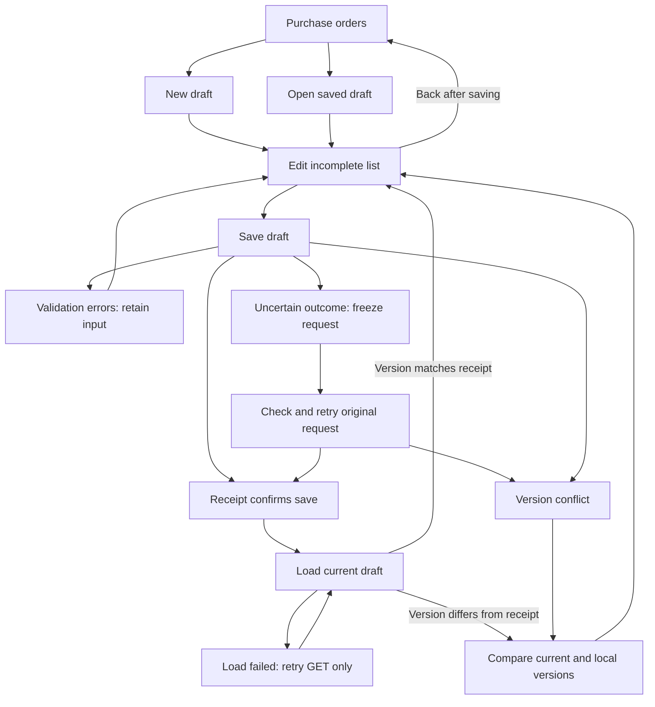

# PO-01: save and resume draft supplier orders

**Status:** Proposed — implementation design awaiting approval.

## Scope

Implement PO-01 from the [purchasing scenario](2026-09-11-purchase-orders-and-purchase-finances.md):
save an incomplete supplier shopping list and resume it across sessions. Drafts create no inventory,
acquisitions, payment obligations, or ledger entries. PO-02 through PO-19 remain separate increments.

## Design and affected contracts

The existing collection and acquisition records describe holdings and their origin, not planned
purchases. Add a Purchasing module inside the existing React/ASP.NET Core/SQL Server application,
following existing tenant authority, restricted SQL commands, and generated API conventions.

Add Purchase orders to authenticated navigation. List saved drafts by most recently saved time,
with title, optional supplier, and last-saved date. New draft opens an editor with explicit Save draft.
Reopening a draft resumes editing. Empty drafts are valid; use “Untitled draft” as a display fallback.

All business fields are optional:

- Title and provisional supplier name, each at most 200 UTF-16 code units; notes, at most 10,000.
- Up to 20 source links: absolute HTTP(S) URLs, each at most 2,048 code units.
- Up to 100 ordered shopping-list entries with stable UUIDs, optional description (500), notes
  (2,000), source link (2,048), and nullable indicative price.
- One optional three-letter currency for the draft; it is required when any price is entered.

Indicative prices are exact nonnegative decimal(19,4) values. Reject excess precision rather than
rounding. Null displays as “Unknown”; explicit zero displays as zero. No totals are calculated.
Prices are reference amounts as noted by the owner, not commitments or structured unit prices.
Record quantities and pricing bases in notes until PO-03 defines structured itemization. Changing
currency requires clearing existing prices first; never silently relabel an amount.

For PUT, changing an already selected currency is allowed only when the replacement contains no
prices. A single save may clear all prices and change currency together; re-enter prices in a later
save. Choosing the first currency on a previously unpriced draft may accompany new prices. The
restricted command compares stored/submitted currencies and returns a 400 currency field error
for a disallowed transition. The editor preserves the last saved currency until that clearing save
succeeds, so clearing locally and immediately re-entering prices cannot bypass the transition rule.

Shopping-list entries can be removed while editing. There is no order deletion, commitment,
attachment, formal PO numbering, supplier directory, receiving, payment, or export feature here.

## Database schema

These are proposed definitions, not an applied migration. Both tables belong to Purchasing and
have no inventory, acquisition, invoice, or payment foreign keys.

### Purchasing.DraftOrders

| Column | SQL type | Rules |
| --- | --- | --- |
| Id | uniqueidentifier NOT NULL | Server-generated, nonempty primary key. |
| TenantId | uniqueidentifier NOT NULL | FK to existing tenant; derived from verified context. |
| Title | nvarchar(200) NULL | Trimmed; blank becomes null, no stored fallback title. |
| SupplierName | nvarchar(200) NULL | Trimmed provisional text; not a supplier identity. |
| Currency | varchar(3) NULL | Exactly three uppercase ASCII letters under a binary CHECK. |
| Notes | nvarchar(max) NULL | CHECK at most 10,000 UTF-16 code units; preserve nonblank text. |
| ContentSchemaVersion | smallint NOT NULL | CHECK equals 1. |
| ContentJson | nvarchar(max) NOT NULL | Valid JSON object, at most 1 MiB UTF-16 storage. |
| CreatedAtUtc | datetimeoffset(7) NOT NULL | Server UTC, immutable. |
| UpdatedAtUtc | datetimeoffset(7) NOT NULL | Server UTC, at least creation time. |
| CreatedByUserId | uniqueidentifier NOT NULL | Tenant-qualified FK to existing user identity. |
| UpdatedByUserId | uniqueidentifier NOT NULL | Tenant-qualified user FK for latest successful mutation. |
| RowVersion | rowversion NOT NULL | Database-generated concurrency token. |

Add unique alternate key `(TenantId, Id)` and browse index
`(TenantId, UpdatedAtUtc DESC, Id DESC) INCLUDE (Title, SupplierName)`. FKs use NO ACTION;
identity disabling preserves references. CHECK constraints enforce timestamps, JSON validity,
version and storage bounds. Use DATALENGTH for UTF-16 limits rather than LEN, which ignores trailing spaces.
Restricted commands additionally enforce JSON structure, counts, unique nonempty entry IDs, URL rules,
text lengths and exact price precision/range. No direct runtime write can bypass these commands.

ContentJson contains exactly `sourceLinks` and `entries`; array order is display order:

```json
{
  "sourceLinks": ["https://supplier.example/cart"],
  "entries": [{
    "id": "85c6e2c2-9b57-42fb-a1a1-b37169a7599a",
    "description": "Blue sapphires",
    "notes": "Parcel price not confirmed.",
    "sourceLink": null,
    "indicativePrice": null
  }]
}
```

Prices satisfy decimal(19,4) but are canonical decimal strings in JSON, not decimal columns.
SQL must reject rounding conversions. There is no entry table or entry-level concurrency:
whole-document replacement is atomic. Later itemization needs an explicit migration preserving
reference-price meaning; these entries are not committed order lines.

### Purchasing.DraftOrderRequestReceipts

| Column | SQL type | Rules |
| --- | --- | --- |
| TenantId, RequestId | uniqueidentifier NOT NULL | Composite PK; nonempty request ID shared across create/update. |
| DraftOrderId | uniqueidentifier NOT NULL | Composite FK `(TenantId, DraftOrderId)` to draft. |
| Operation | varchar(6) NOT NULL | Binary CHECK: Create or Update. |
| ActorUserId | uniqueidentifier NOT NULL | Tenant-qualified user FK; original actor. |
| ExpectedRowVersion | binary(8) NULL | Null exactly for Create; required for Update. |
| FingerprintVersion | smallint NOT NULL | CHECK equals 1; identifies normalization, serialization and hashing rules. |
| InputFingerprint | binary(32) NOT NULL | Server-computed SHA-256 of canonical operation/target/version/content. |
| ResultRowVersion | binary(8) NOT NULL | Version produced by the successful save; immutable bytes, not a rowversion column. |
| CompletedAtUtc | datetimeoffset(7) NOT NULL | Server UTC. |

Retain compact receipts indefinitely for this increment. They prove a request succeeded and identify
its draft and resulting version, without retaining historical input or response documents. PO-01
requires duplicate prevention and changed-input rejection, not historical response reconstruction.
Receipt storage grows by a fixed amount per successful save; pruning still requires a later explicit
replay-expiry contract. No autosave or unchanged client resubmissions. These receipts are private
operational evidence, not an audit-history feature or an anonymization of the draft content.

Both tables get tenant RLS filter/block predicates and EF query filters. Web gets SELECT and
EXECUTE on `Purchasing.CreateDraftOrder` and `Purchasing.UpdateDraftOrder`, with direct
INSERT/UPDATE/DELETE denied. Workers receive no purchasing grants. User/tenant authority comes
from verified session context, never HTTP fields.

In one transaction, acquire a transaction-owned application lock for `(TenantId, RequestId)`;
check immutable receipts before executing a mutation. Matching operation, target, expected version
and fingerprint returns the recorded success receipt; mismatch returns 409. For a new update, lock
the draft, check version, validate, update, capture the new rowversion, and insert its receipt before commit.
Different requests targeting the same draft serialize on that row. Failures leave no partial save.
Revalidate authority for retries; a currently authorized member may resolve a same-business request
without changing its original actor. Check target visibility before update-conflict details: foreign
IDs always return 404. Normalization compares exact Unicode content, not SQL linguistic equality.

Fingerprint V1 serializes a fixed-order JSON object containing `operation`, `targetId` (null for
Create, normalized route UUID for Update), `expectedVersion` (null for Create), and normalized `draft`.
Use the DTO field order below, explicit nulls, lowercase D-format UUIDs, four-decimal price strings,
and preserved array order, with the pinned System.Text.Json default escaping and no indentation.
The restricted command computes SHA-256 over the canonical JSON's UTF-16LE bytes using
`HASHBYTES('SHA2_256', CONVERT(varbinary(max), @CanonicalInputJson))`; never accept a client digest.
The server prepares the canonical document and the command uses that same document for validation
and persistence, not an independently supplied body. Canonical input exists only while processing
the request and is not stored in the receipt. Request ID and tenant are the receipt key; the actor
is recorded separately and excluded from the fingerprint to permit authorized same-business retries.
Retain V1 computation for existing receipts if future normalization changes. A cryptographic hash
collision is the accepted residual risk of fingerprint comparison; complete input equality would
require retaining the input. Check receipts before state-dependent currency/version rules so a
successful retry still resolves after later edits.

## API contract

The notation below defines the proposed generated OpenAPI DTOs. All shown properties are required
on the wire; incomplete business fields use null/empty arrays. Unknown fields are rejected, including
nested objects. PUT is full replacement, not patch. Clients supply neither tenant/actor nor timestamps.

```typescript
type DraftEntry = {
  id: string; // nonempty UUID generated by editor, unique within draft
  description: string | null;
  notes: string | null;
  sourceLink: string | null;
  indicativePrice: string | null; // exact decimal string, never JSON number
};
type DraftContent = {
  title: string | null;
  supplierName: string | null;
  currency: string | null;
  notes: string | null;
  sourceLinks: string[];
  entries: DraftEntry[];
};
type CreateDraftOrderRequest = { requestId: string; draft: DraftContent };
type UpdateDraftOrderRequest = {
  requestId: string;
  expectedVersion: string; // base64 of exactly eight bytes
  draft: DraftContent;
};
type DraftOrderResponse = {
  id: string;
  draft: DraftContent;
  createdAtUtc: string; // ISO 8601 UTC, full round-trip precision
  updatedAtUtc: string;
  version: string; // opaque base64 rowversion, not edit count
};
type SaveDraftOrderResponse = {
  requestId: string;
  replayed: boolean;
  draftOrderId: string;
  savedVersion: string; // version produced by this request, not necessarily current
  completedAtUtc: string; // original successful operation time
};
type DraftOrderSummary = {
  id: string;
  title: string | null;
  supplierName: string | null;
  updatedAtUtc: string;
};
type DraftOrderPageResponse = {
  items: DraftOrderSummary[];
  nextCursor: string | null;
};
```

Accept prices matching `^(0|[1-9][0-9]{0,14})(\.[0-9]{1,4})?$`, normalize to four fractional digits,
and preserve exact values in the browser. Reject signs, separators, whitespace, exponent notation,
JSON numbers and excess precision. Uppercase currency; trim title, supplier, description and links.
Whitespace-only optional text becomes null; otherwise preserve notes verbatim. Currency codes are
notation, not a guarantee of currency conversion support. Links require absolute HTTP(S), a hostname,
and no embedded username/password. Do not fetch or rewrite them beyond trimming. Maximum HTTP body:
4 MiB. Fingerprinting uses deterministic property ordering; array order is significant.

Field/count limits and aggregate serialized-size limits both apply. Escaping can enlarge JSON even
when each field is valid. Validate the UTF-16 byte size of canonical ContentJson against its 1 MiB
storage cap before SQL writes; return 400 `draft_validation_failed` with an error at `draft` when
it is exceeded. Keep input and explain that the draft needs shortening. Canonical fingerprint input
is bounded by the validated field/count limits and is transient; there are no stored request/response JSON caps.
SQL repeats these size checks. Test escape-heavy content as well as ordinary maximum-length text.

| Endpoint | Success | Body / headers |
| --- | --- | --- |
| POST /api/purchase-order-drafts | 201 first save, 200 replay | SaveDraftOrderResponse; Location points to detail API on both outcomes. |
| PUT /api/purchase-order-drafts/{id} | 200 | SaveDraftOrderResponse. |
| GET /api/purchase-order-drafts/{id} | 200 | Current DraftOrderResponse. |
| GET /api/purchase-order-drafts?cursor=… | 200 | DraftOrderPageResponse. |

All responses are private/no-store. Existing session cookies and mutation antiforgery apply.
A new save uses a new request UUID; uncertain retries retain it and the original payload/version.
After every confirmed save, including replay, GET current detail before enabling further editing.
The compact success body is not a draft document; never treat it as current content. A failed GET displays
“Saved; current version could not be loaded” with retry, never starts a second creation.

Example empty creation (valid despite having no supplier or entries):

```json
{
  "requestId": "41375594-5dc9-48ce-bc41-14c1b0ce1f17",
  "draft": {
    "title": null, "supplierName": null, "currency": null, "notes": null,
    "sourceLinks": [], "entries": []
  }
}
```

Example 201 response, with a Location header ending in the returned ID:

```json
{
  "requestId": "41375594-5dc9-48ce-bc41-14c1b0ce1f17",
  "replayed": false,
  "draftOrderId": "48879967-4f0a-4e18-a849-9aa8af387b23",
  "savedVersion": "AAAAAAAAB9E=",
  "completedAtUtc": "2026-09-12T02:00:00.0000000Z"
}
```

GET `/api/purchase-order-drafts/48879967-4f0a-4e18-a849-9aa8af387b23` returns the current
DraftOrderResponse, including normalized content, creation/update timestamps and current version.
To update, send a fresh requestId, that GET's version as expectedVersion, and the complete edited draft.
Successful update returns a receipt with the same draft ID and its new savedVersion/completion time.
Exact replay sets replayed to true and returns the original receipt identifiers/version/time, without
re-executing the save or reproducing historical content. Replay after later edits does not change them.

If GET's version equals savedVersion, show the normalized saved document. If it differs, the request
still succeeded, but somebody edited the draft afterward: retain submitted input and offer comparison
with the current document before further edits. Use the GET version only after deliberate review,
never the old receipt version. If GET returns 404 or authentication fails, apply the usual access
handling; a receipt is not an access grant. Never retry a confirmed creation merely because GET failed.

### Failure schemas

Purchasing problems use application/problem+json with type, title, status and stable code.
Validation also includes `errors: Record<string, string[]>`, keyed to request paths:

```json
{
  "type": "about:blank",
  "title": "Review the draft fields.",
  "status": 400,
  "code": "draft_validation_failed",
  "errors": { "draft.entries[0].indicativePrice": ["Use up to four decimal places."] }
}
```

| Status / code | Handling |
| --- | --- |
| 400 draft_validation_failed | Retain input; summary and field errors. |
| 400 invalid_cursor | Retain rows; offer Refresh drafts. |
| 401 / existing authentication problem | Existing authentication-loss flow clears private state. |
| 403 / existing authority/antiforgery problem | Existing authority handling; no mutation. |
| 404 draft_not_found | Missing or foreign target; indistinguishable. |
| 409 draft_version_conflict | GET latest, retain input, require deliberate reconciliation. |
| 409 draft_request_conflict | Same UUID with changed input; never silently generate a replacement UUID. |
| 413 / body limit | Retain input and report limit. |
| 5xx or interrupted response | Outcome uncertain; retry original request. |

Binding/infrastructure failures may lack code: use status-based fallback. Do not echo private values
or current records in problems. Matching current fields never proves a request succeeded.

## Pagination contract

Use forward keyset pagination with a fixed page size of 50, no offset, page numbers, total count,
search or filters in PO-01. Order by UpdatedAtUtc DESC, Id DESC within the active tenant.

1. Omit cursor on the first request. Fetch 51 rows and return the first 50.
2. If row 51 exists, nextCursor encodes the last returned row, not the extra row; otherwise null.
3. Send that cursor unchanged, URI-encoded. Apply
   `UpdatedAtUtc < @time OR (UpdatedAtUtc = @time AND Id < @id)`, with the same tenant/order clauses.
   UUID comparison uses SQL Server native uniqueidentifier ordering, never client string order.

Cursor format: `v1_<UTC timestamp in O format>_<UUID in N format>`, at most 128 characters.
Keep all seven fractional timestamp digits. Reject unknown versions, malformed timestamps, non-UTC
values or empty UUIDs with 400. Opaque to clients, it is not secret or an authorization token.
It need not name an existing row. All page requests independently apply current tenant authority.

Example terminal page:

```json
{
  "items": [{
    "id": "48879967-4f0a-4e18-a849-9aa8af387b23",
    "title": null, "supplierName": null,
    "updatedAtUtc": "2026-09-12T02:00:00.0000000Z"
  }],
  "nextCursor": null
}
```

This is a live list, not a multi-request snapshot. Edits/new records can move above the cursor and
remain unseen until refresh. If clock movement makes a seen row move below the cursor, deduplicate
appended rows by ID. Successful local saves invalidate loaded pages and restart from page one.
Back without changes restores loaded rows/scroll. Refresh restarts; replace existing rows only once
its first page succeeds. Do not promise snapshot completeness.

Show Load more only for a non-null nextCursor. Preserve rows/cursor after page failure and retry
that page. Disable duplicate in-flight loads; ignore stale responses after refresh or navigation.
No records means `{ "items": [], "nextCursor": null }`. Exactly 50 rows does not imply another page.
Tests include 0/50/51/101 rows, identical timestamps, cursor tampering, tenant isolation, failed-page
retry, edits across page boundaries, and obsolete response handling.

## UX and flows

Use the existing Tanzanite shell, wordmark, neutral actions, floating-label fields, appearance and
collapsed navigation from [DESIGN.md](../../DESIGN.md). Client routes: `/purchase-orders`,
`/purchase-orders/new`, `/purchase-orders/{id}`. Only Draft status exists in this increment.

| Screen | Content and primary action |
| --- | --- |
| Draft list | Purchase orders; “Plan a purchase and pick it up later.”; New draft, Refresh, title/supplier/saved-time rows, Load more. |
| Empty | “No draft orders yet.” and New draft. |
| Editor | Back, heading and Draft badge; title/supplier/currency, notes, source links, shopping list; Save draft and saved/unsaved state. |
| Entry | Description, optional reference price with Unknown placeholder, notes and source link; labeled remove action. |
| Uncertain save | “We couldn’t confirm your save.” and Check and retry; freeze sent input until resolved. |
| Conflict review | Current saved and Your changes; side by side on desktop, stacked on mobile; no automatic merge. |

Explain once near the editor heading: “Draft only — no payment or inventory changes.” Beside pricing:
“Prices are reference amounts; no total is calculated.” Blank currency says Not set, not an inferred
currency. Unknown differs visibly from explicit zero. Notes can describe quantities/pricing bases.
Add entry/link never requires completing previous optional fields. Removing entries edits only the draft.

Desktop editor has two-column header fields and full-width stacked entry groups; mobile stacks all
fields. Save stays reachable without overlaying content. Use visible labels, 44px targets, specific
accessible names for repeated actions, keyboard order, live saved status and linked error summaries.
Empty optional values are not errors. Status is never conveyed by color alone.



First receipt replaces the new-editor URL with draftOrderId; it keeps the editor open and announces
completedAtUtc as the confirmed saved time while loading current content. Enable editing after the
GET succeeds and any newer-version comparison is resolved. A failed GET retains a confirmed-save
state and retries only the read. Later sessions reopen that saved record. Unsaved navigation offers Keep
editing or Discard changes. Discard never deletes the saved draft. Uncertain-save departure explains
that the save may have succeeded and departure loses the in-memory retry request. Browser closure
uses the existing native unsaved-work warning.

Conflict review retains the complete local draft and fetches current content, including every field
and added/removed entry. Use saved version discards local edits. Continue with my changes adopts the
reviewed token and returns local input to the editor, where the user reconciles then explicitly saves
with a new request UUID. Another intervening change conflicts again. Failed refresh retains input
and offers retry. No automatic overwrite, merge, or resubmission.

The interactive mock demonstrates list/edit/save/reopen, empty drafts, entry editing, unknown/zero,
uncertain-save retry, conflict review and unsaved navigation using in-memory sample data. It does not
establish persistence, pagination, authorization or concurrency. Keep mock media outside Git; these
screen/flow descriptions are the durable specification. Both light/dark and narrow/wide layouts are
review targets; this does not redesign existing application navigation.

## Failure behavior and security

Keep input and its original request after an uncertain save; retry that exact request before sending
new edits. Conflicts retain local input and show current saved content for deliberate reconciliation
before a new request/version. Validation and network errors retain the editor. Distinguish loading,
empty, saving, saved, and failed states. Protect unsaved navigation with the existing discard flow.

Only saved content survives reload/browser closure. Keep unsaved work in authenticated application
memory, never local storage; clear it on authentication loss. Saved content and immutable request
evidence remain in SQL/backups; deletion/retention management is a later contract.

Treat all fields as private business data; do not log bodies or field values. Render text safely,
validate HTTP(S) links and isolate their opener, and never fetch source links server-side. Bound
request size and document structure. Before implementation, review tenant reads/writes, restricted
principal grants, replay identity, and cross-tenant UUID collisions against existing security guidance.

## Migration and recovery

Add one migration after `AddAcquisitionDocuments` for tables, RLS, commands/grants, and readiness,
provisioning, and backup schema markers. No existing records are backfilled or synthesized.
Verify fresh creation and upgrade retaining identity, collection, acquisition, and document data.
Block destructive Down to preserve drafts/replay evidence. Recover through forward correction or
the existing guarded restore procedure; older binaries may reject the new readiness marker.
Production migration or restore remains outside implementation authorization.

## Alternatives and tradeoffs

Browser-only storage cannot reliably resume across devices and lacks server-enforced business
ownership. Acquisition reuse misrepresents planned purchases. Full structured PO lines would decide
PO-03 prematurely. Bounded JSON shopping lists deliver resumable planning, with an explicit migration
needed when later itemization introduces quantities, units, and pricing bases. Full request/response
snapshots would reproduce historical save responses, which PO-01 does not require. Compact receipts
retain duplicate prevention with bounded per-save storage and require a current-detail GET after success.

## Acceptance and delivery

Write focused failing tests first with GIVEN/WHEN/THEN comments. Cover empty drafts, entries,
notes/links, null versus zero, currency and precision validation, limits, retained input, exact retries
after later edits, mismatched retries, concurrent saves, authorization, and antiforgery. Use real SQL
to verify transactions, RLS, restricted principals, and cross-tenant reads/writes. Assert saves create
no inventory/acquisition or financial records. Run affected mutation tests and document exclusions
or tooling limitations.

Receipt coverage must prove atomic save/receipt rollback, competing retries producing one mutation,
stable receipt ID/version/time after later edits, and rejection when operation, target, expected version
or normalized content changes under the same request ID. Cover equivalent normalized inputs, significant
array order, tenant isolation, retained fingerprint-version behavior, and absence of stored historical
bodies. Client tests cover successful-save GET failure without another mutation, newer-version comparison,
and continued recovery using the original request only while its outcome remains uncertain.

Browser walkthrough: save an incomplete cart with unknown prices, reopen it, sign out/in and resume,
add notes and a known price, save/reload, and exercise failed-save and conflict recovery. Inspect
mobile/keyboard use and existing collection navigation using the established design system.

Regenerate API declarations; update living product, architecture, and migration documentation.
Run `scripts/verify.ps1` and `scripts/smoke-container.ps1`; inspect the current-source preview from
`scripts/dev-up.ps1` and report its URL and verification limits. Complete internal review, commit the
scoped changes, and open a ready-for-review PR. This design includes no merge or production action.
